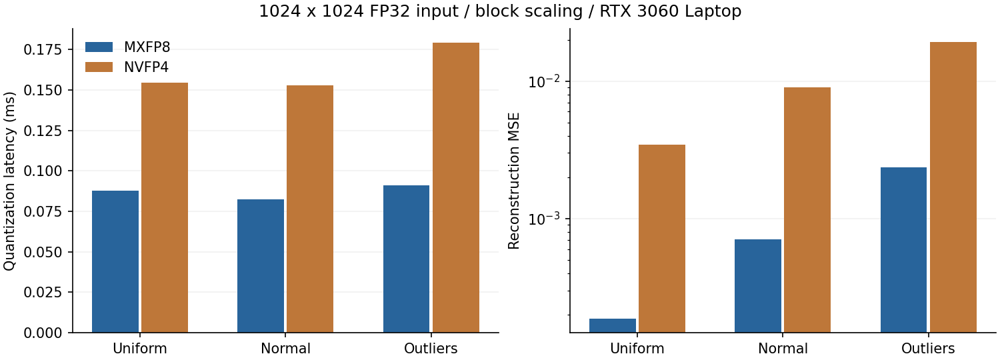

# 题目 2 首版实验归档：MXFP8 / NVFP4 软件量化与反量化

> 本文保留首版 RTX 3060 Laptop 实验与实现说明。当前实现与结论见 [总结报告](REPORT.md)；本文中的“当前”“下一步”均指首版实验时点。

作者：zmuxuny

## 完成结果

本项目在常规 CUDA GPU 上实现从 FP32/FP16 输入到低精度文件，再到 FP16/BF16/FP32 输出的完整流程。两种格式均支持真实 bit 宽度存储、块级与张量级缩放、最近偶数舍入与可复现随机舍入，并提供独立文件重载反量化。

实测日期：2026-09-19。GPU：RTX 3060 Laptop 6 GiB（sm_86）；CPU：Ryzen 7 6800H，WSL 分配 8 个逻辑 CPU；系统：Ubuntu / WSL2；CUDA Toolkit 11.5、GCC 10.5、驱动 576.80。编译目标为 sm_75 + compute_75 PTX，使用 `-O3 --fmad=false -lineinfo`，未启用 fast-math。完整环境记录见 `results/environment.json`。

## 格式、缩放与文件协议

MXFP8 使用 E4M3 元素和 E8M0 缩放。默认每行每 32 个元素组成一个块，`s=2^ceil(log2(amax/448))`，指数裁剪至 [-127,127]，全零块取 s=1。量化为 `E4M3_RNE/SR(x/s)`，反量化为 `decode(q)*s`。标准格式与缩放策略依据 [NVIDIA MXFP8 文档](https://docs.nvidia.com/deeplearning/transformer-engine/features/low_precision_training/mxfp8/mxfp8.html)。

NVFP4 使用 E2M1 四位元素、默认每 16 个元素共享的 E4M3 局部 scale，以及 FP32 全局 scale。`g=global_amax/(448*6)`，`s=E4M3_RNE((block_amax/g)/6)`；量化为 `E2M1_RNE/SR((x/g)/decode(s))`，反量化为 `(decode(q)*decode(s))*g`。依据 [NVIDIA NVFP4 文档](https://docs.nvidia.com/deeplearning/transformer-engine/features/low_precision_training/nvfp4/nvfp4.html)。全零张量 g=1；极小 g 下限取 FP32 最小正规值；局部 scale 舍入为零时输出零码。

NVFP4 偶数列占低半字节、奇数列占高半字节，每个输出线程独占一个字节，避免 packed store 竞争。奇数列末尾补一个零半字节。scale 数组按行主序排列，块不跨行。FP8 元素负零保留符号，最近舍入采用 ties-to-even；随机舍入按相邻值距离选择，seed 与全局元素索引决定随机数，与 CUDA launch 排布无关。

输入输出文件有 32 字节版本化 header，packed 文件有 56 字节 header，后接一字节 scale 数组和 packed data。字段定义、解析脚本、异常输入策略见 [README](README.md)。非默认块尺寸和 per-tensor 模式属于对照扩展；交换格式不含硬件 GEMM 的 swizzle。

## CUDA 实现与优化

1. 全局 amax 在设备端分层计算：线程分段遍历、warp 最大值归约、每 warp 一次无符号原子最大值。仅 NVFP4 或 per-tensor 模式需要这一遍。
2. 局部缩放由一个 warp 处理一个量化块，一 CTA 处理 8 个块；尾块只读取有效元素。MXFP8 block 模式不需要张量级同步。
3. FP8 编码用指数分解和尾数舍入代替遍历码本；FP4 编码使用分段索引。FP4 由一线程编码两个元素并写一个 packed byte，反量化按位提取。
4. FP32 计算、FP16/BF16 存储转换分离，BF16 使用整数舍入，不引入原生 BF16 指令依赖。RAII 设备缓冲区在重复测量期间复用。

独立测试发现，若先将浮点尾数位置加上整数指数偏移，再执行舍入，会抹掉中点上方一个 ULP，从而错误选择相邻 FP8 码。最终实现先舍入尾数、再组合指数。测试专门覆盖所有有限 FP8 码、中点及其 `nextafter` 两侧；这一修正也同步用于题目 3。

## 正确性

独立 NumPy oracle 通过显式码本搜索编码，CUDA 通过指数/分段算法编码。完整验证通过 **151** 组参数与边界测试，以及 3 组无效文件测试。覆盖 FP32/FP16 输入、三种输出类型、两种格式、两种缩放模式、两种舍入、零值、极端动态范围、奇数列、尾块及多种块大小。每组比较 packed data、scale、global scale、反量化输出和误差指标；另验证从持久化文件单独加载反量化。结果见 [correctness.json](results/correctness.json)。

## 实验结果

每个配置 3 次独立进程运行，每次预热 3 次、CUDA event 计时 100 次，表中列出各指标的三次运行中位数。加速比先在每次运行中计算，再取中位数，因此未必等于表中两个时间中位数之比。使用默认 stream、常驻设备缓冲区；GPU 时钟未锁定，桌面与 WSL 调度会影响短 kernel。CPU 为本项目单线程参考；传输计时不含文件 I/O、分配、参考验证和写盘。

输入形状统一为 1024×1024。uniform 为 U(-1,1)，normal 为 N(0,1)，outliers 为标准正态中按概率 0.001 选中元素并乘 50；固定 seed=42。下表为 FP32 输入、FP32 输出、默认块大小、nearest 舍入。

| 分布 | 格式 | 量化 ms | 反量化 ms | 最大绝对误差 | MAE | MSE |
| --- | --- | --- | --- | --- | --- | --- |
| uniform | mxfp8 | 0.0880 | 0.0543 | 0.0312499 | 0.01042 | 0.000186177 |
| uniform | nvfp4 | 0.1548 | 0.0403 | 0.166662 | 0.0443061 | 0.00344867 |
| normal | mxfp8 | 0.0827 | 0.0436 | 0.24472 | 0.0179733 | 0.000706241 |
| normal | nvfp4 | 0.1529 | 0.0408 | 0.587548 | 0.0714274 | 0.00904878 |
| outliers | mxfp8 | 0.0912 | 0.0478 | 7.44952 | 0.0188316 | 0.00236072 |
| outliers | nvfp4 | 0.1791 | 0.0480 | 8.87808 | 0.0796653 | 0.0191312 |

实际压缩率将局部 scales 和 FP32 全局 scale 计入 payload：

| 输入 | 格式 | 数据 bytes | scale bytes | payload 压缩率 | 完整文件压缩率 |
| --- | --- | --- | --- | --- | --- |
| fp32 | mxfp8 | 1048576 | 32768 | 3.8788× | 3.8786× |
| fp32 | nvfp4 | 524288 | 65536 | 7.1111× | 7.1105× |
| fp16 | mxfp8 | 1048576 | 32768 | 1.9394× | 1.9393× |
| fp16 | nvfp4 | 524288 | 65536 | 3.5555× | 3.5553× |

块缩放与全张量缩放的误差对比：

| 分布 | 格式 | block MSE | tensor MSE | tensor/block |
| --- | --- | --- | --- | --- |
| normal | mxfp8 | 0.000706241 | 0.000706241 | 1.00× |
| normal | nvfp4 | 0.00904878 | 0.0183431 | 2.03× |
| outliers | mxfp8 | 0.00236072 | 0.00236072 | 1.00× |
| outliers | nvfp4 | 0.0191312 | 1.03266 | 53.98× |

局部缩放将异常值影响限定在一个块；全张量缩放则让单个大值影响全部元素的分辨率。这一差异在异常值分布中尤其明显。

标准正态输入下，与同功能单线程 CPU 量化加反量化比较：

| 格式 | CPU ms | GPU 含传输 ms | 加速比 | 量化有效 GB/s | 反量化有效 GB/s |
| --- | --- | --- | --- | --- | --- |
| mxfp8 | 57.952 | 1.536 | 37.56× | 63.81 | 120.91 |
| nvfp4 | 77.491 | 1.309 | 59.22× | 31.29 | 117.21 |

GPU 含传输时间覆盖 H2D 输入、量化和反量化、D2H 重建输出。packed 文件写出及其独立 D2H 下载在测量外。所有性能日志均来自实际运行，完整的 FP16 输入、tensor 模式和三次试验数据见 [benchmark.json](results/benchmark.json)。CPU 基准未做 SIMD/多线程优化，比较对象是项目参考实现。

## 工具检查与后续优化

已尝试新版 Compute Sanitizer 2025.2.1（CUDA 12.9 配套），但 Windows 侧 WDDM 调试接口未启用，工具要求管理员运行 EnableDebuggerInterface.bat，并在 kernel 检查前退出。此次未取得 sanitizer 检查通过结果。原始命令和输出保存在 `results/{memcheck,racecheck,synccheck}.txt`。

当前 Nsight Compute 2021.3.1 在设备检查阶段明确报告不支持本机 WSL，未取得硬件计数器数据。`results/ncu.txt` 保留原始错误；本文带宽是逻辑字节数除以 CUDA event 时间，不据此宣称达到某个 DRAM 利用率。可在支持的分析环境运行 `python3 tests/profile.py --ncu /path/to/ncu --sanitizer /path/to/compute-sanitizer` 重现。

下一步可对固定默认块布局专门化地址计算，将局部 scale 计算和量化写出融合以减少输入重读；目前为了支持任意行尾和多种块大小，使用通用索引。国产平台尚未实现；本次没有使用原生 FP8/FP4 硬件路径或第三方量化库。

## 复现与提交

`make && python3 tests/validate.py && python3 tests/benchmark.py` 可重建测试和计时数据；`python3 tests/report.py` 从本题的 JSON 重建报告与图。代码位于上游 `2026-summer-project` 基础上的 `02_quant_dequant/zmuxuny/`，可独立提交。
