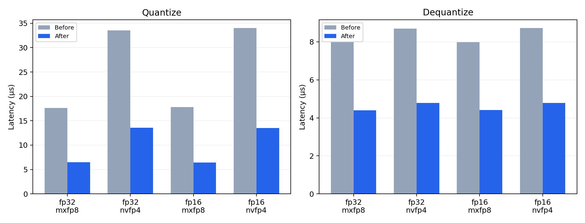

# RTX 4090 D 优化实验

实测日期：2026-09-19。基线为本题首版提交 `73b66de`（与实际构建的本地集成快照 `deba5cb` 对应目录完全相同），优化前后均在同一台 RTX 4090 D 24 GiB 上执行。CUDA 12.8、驱动 570.124.06、GCC 13，编译目标 `sm_89`，使用 `-O3 --fmad=false -lineinfo`。环境和基线可执行文件 SHA256 见 [environment.json](results/4090d/environment.json)。

## 测量方法

常规基准每配置运行 3 个独立进程，每进程预热 3 次、CUDA event 重复 100 次，取时间中位数。大张量每配置同样 3 次，重复 30 次；优化前后进程交替运行以减少温度与时钟漂移的影响。GPU 未锁频。表内加速比统一按两个时间中位数之比计算。

kernel 计时不含文件 I/O、CPU 参考、设备分配和传输；NVFP4 的计时包含全局 amax 清零、归约和输出阶段。输入驻留设备且重复访问，常规尺寸可能受 L2 缓存加速，因此另测单个输入即为 128 MiB 的大张量。有效 GB/s 是逻辑读写量除以时间，不作为 DRAM 利用率。

## 实现变化

- 默认 32/16 元素块将块 amax、scale 编码、元素量化与 packed 写出合并为一个 kernel，输入只读一遍。整块对齐的行使用连续一维 tile；非整块和奇数列保留按行索引，NVFP4 每个字节仅一个线程写入。
- FP8 编码从 FP32 位域提取指数、尾数和舍入残数；FP8/FP4 解码直接构造浮点位域。NVFP4 最近舍入直接比较 scale 乘以精确 FP4 中点，避免再做一次除法，并穷举所有正 E4M3 scale 下的中点及相邻 ULP 验证；随机舍入保留原商与概率。MXFP8 使用精确二次幂倒数乘法，E8M0 最小 scale 的特殊情况仍用除法。随机舍入、最近偶数舍入和文件格式保持一致。
- 全局 amax 先归约到每个 warp，再通过共享内存归约到整个 CTA，将原子更新从每 warp 一次降至每 CTA 一次。
- 默认格式的反量化专门化索引，NVFP4 一次读取一个字节、输出两个值。自定义块长沿用通用 kernel。

## 常规尺寸：1024×1024，标准正态

| 输入 | 格式 | 量化前/后 μs | 量化加速 | 反量化前/后 μs | 反量化加速 |
| --- | --- | --- | --- | --- | --- |
| fp32 | mxfp8 | 17.603 / 6.461 | 2.72× | 7.977 / 4.403 | 1.81× |
| fp32 | nvfp4 | 33.536 / 13.537 | 2.48× | 8.704 / 4.781 | 1.82× |
| fp16 | mxfp8 | 17.777 / 6.451 | 2.76× | 7.976 / 4.413 | 1.81× |
| fp16 | nvfp4 | 34.007 / 13.517 | 2.52× | 8.724 / 4.792 | 1.82× |

所有 24 组常规基准的 MAE、MSE 和最大绝对误差与基线一致。完整均匀分布、正态、异常值，以及 per-tensor/per-block 和 FP16/FP32 数据见 `before/benchmark.json`、`after/benchmark.json`。

## 大张量：输入 128 MiB

| 输入形状 / dtype | 格式 | 量化前/后 μs | 加速 | 反量化前/后 μs | 加速 |
| --- | --- | --- | --- | --- | --- |
| 32768×1024 / fp32 | mxfp8 | 491.32 / 190.74 | 2.58× | 238.59 / 137.83 | 1.73× |
| 32768×1024 / fp32 | nvfp4 | 986.08 / 415.64 | 2.37× | 271.43 / 168.86 | 1.61× |
| 65536×1024 / fp16 | mxfp8 | 967.68 / 349.08 | 2.77× | 475.07 / 274.15 | 1.73× |
| 65536×1024 / fp16 | nvfp4 | 1932.83 / 752.09 | 2.57× | 540.02 / 338.16 | 1.60× |

## 正确性

独立 NumPy 码本 oracle 通过 **158 组测试及 3 组无效文件测试**。新增超过 65535 行的单列张量、全块极小 FP32 和大数，覆盖新网格索引及 E8M0 倒数边界。packed data、scales 和重建值逐项比较。



## Profiler / Sanitizer

Compute Sanitizer 的 memcheck、racecheck、synccheck 共 **12 次检查全部通过**；原始命令及输出见 `results/4090d/after/*check_*.txt`，状态汇总见 [profiling.json](results/4090d/after/profiling.json)。

Nsight Systems 成功采集 MXFP8/NVFP4 两组 CUDA 时间线，原始 `.nsys-rep` 可在 GUI 打开，kernel/API 汇总见 `nsys_stats_*.csv`。具体 kernel 耗时、调用次数及瓶颈分析见 [PROFILING.md](PROFILING.md)。

Nsight Compute 返回 `ERR_NVGPUCTRPERM`，该容器所在宿主机限制硬件计数器访问；保留 `ncu.txt` 原始输出。本报告的性能结论使用无插桩 CUDA event 基准，时间线用于确认执行步骤，未把工具失败计作通过。

## 复现

```bash
make clean
make ARCH=89 NVCC=/usr/local/cuda/bin/nvcc HOSTCXX=g++
python3 tests/validate.py
python3 tests/benchmark.py --trials 3 --repeats 100
python3 tests/profile_native.py
# 分别从基线提交和当前提交构建两个可执行文件：
python3 tests/benchmark_extended.py --before /path/to/baseline/quantize --after build/quantize
# 归档 JSON 后重建本报告和图：
python3 tests/report_4090.py
```

基线与新版本原始 JSON 分别保存在 `results/4090d/before/` 和 `after/`，大张量交替试验见 `extended.json`。原 RTX 3060 Laptop 数据保留在 `results/` 根目录和原报告中。

## 旧 Toolkit 兼容验证

另在本机 RTX 3060 Laptop / CUDA 11.5 / GCC 10.5 上通过相同正确性测试；题目 2 编译目标 sm_75，题目 3 编译目标 sm_86 并验证新 Tensor Core 路径。结果见 [compatibility_3060.json](results/compatibility_3060.json)。
