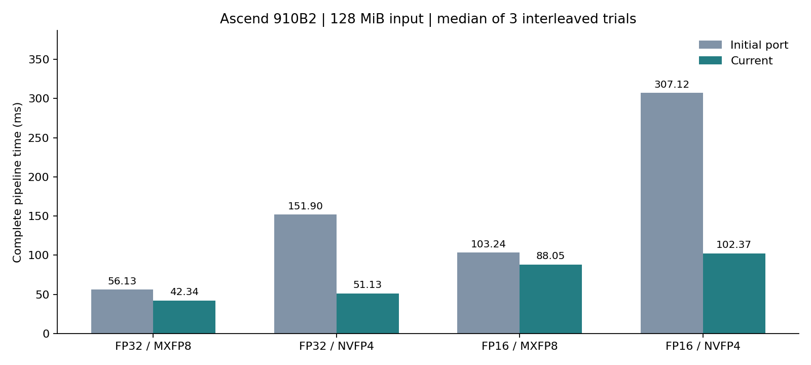

# 昇腾 910B2 适配、验证与性能报告

实测日期：2026-09-20。训练营 ID：曹泽阳。

完成原生 Ascend C 实现，182 组正确性测试通过；基础 memcheck 4 组和 msprof 4 组均完成。128MiB FP16/NVFP4 完整量化从 307.118 ms 降至 102.372 ms，为初始正确移植的 3.00×；同表保留反量化的改善或回退。

## 环境与运行

单卡 Ascend 910B2，64GB HBM，ARM64 鲲鹏主机；CANN 9.0、毕昇编译器及驱动 26.1.1。ACL 使用容器内逻辑设备 0，`npu-smi` 显示物理卡 1。AIV 编译目标为 `dav-c220-vec`，Cube 为 `dav-c220-cube`；调度上限分别为 48 和 24 个 block。[完整环境](results/ascend/environment.txt)。

```bash
source /usr/local/Ascend/ascend-toolkit/set_env.sh
make PLATFORM=ascend
make PLATFORM=ascend test
python3 tests/profile_ascend.py --tool profile
python3 tests/profile_ascend.py --tool sanitize
```

输入、配置、packed 文件和命令行与其他后端共用。`ascend/` 实现 Ascend C 内核及 ACL 运行时适配；主机侧保留原有文件校验和独立 C++ 参考。NPU 实测不依赖 PyTorch 或预装 MatMul 算子包。

## 实现与优化

- 软件 E4M3/E2M1 编码、E8M0/E4M3 缩放、最近偶数与随机舍入共用数值函数；支持 FP32/FP16 输入及 FP32/FP16/BF16 输出。FP4 两个值合成一个字节，奇数行尾高半字节清零。
- 初始实现逐组读取 GM，并为每个 scale 和 packed 小块发起搬运。当前实现每次 DMA 搬入最多 1024 个元素，在 UB 内处理完整缩放组，批量写出对应 data/scale；分块不跨行，支持 16–1024 间 16 的倍数块长。
- 全局 amax 以 4096 元素分块，使用向量转换、Abs、ReduceMax，再归并各 core 的部分最大值。部分最大值间隔 64 字节，避免标量写回共享缓存行。全次正规数 FP32 tile 保留标量回退，防止向量路径冲零改变缩放。
- MXFP8 使用精确的 2 的幂缩放；NVFP4 最近舍入比较缩放后的精确码本中点，随机舍入保留商和按元素索引生成的随机数。反量化直接读取 GM 中的 codes/scales，并批量 DMA 写回输出。
- 输出使用支持字节长度的 DataCopyPad，避免奇数列和相邻组通过标量字节写入产生缓存行冲突；Scalar、Vector、MTE2/MTE3 间以事件同步。最终归约后恢复向量掩码。

## 正确性与兼容性

完整独立参考测试 **182 组通过**，另有 3 组非法输入检查。[NPU 结果](results/ascend/correctness.json)、[RTX 3060 公共代码回归](results/ascend/correctness_nvidia_regression.json)。

两题的共享数值函数分别通过 **49,152 项哈希、65,536 项乘法、1,048,576 项除法**的主机/设备逐位对照，覆盖符号、指数边界、正规数、次正规数和舍入边界。[原始日志](results/ascend/numeric.log)。

## 同机性能对照

基线为[正确性通过的初始 Ascend C 移植](results/ascend/correctness_baseline.json)。基线/当前程序交替运行，每项 3 个独立进程试验取中位数；每条完整流程先预热 3 次，中小输入重复 10 次，128MiB 输入重复 3 次。使用 ACL 事件计时，包含全部 NPU kernel，排除分配、文件 I/O、主机参考与传输。计时保留启动提交间隔，不将其解释为单条硬件指令耗时。每次比较 packed 文件 SHA256。输入为 seed=42 的标准正态数据，最近偶数舍入，默认块缩放。反量化输出固定为 FP32。

[完整逐次记录及可执行文件/动态库 SHA256](results/ascend/comparison.json)。基线及全部可执行文件另存于完整实验备份；正式代码、构建日志和源码校验清单随提交提供。



| 输入 MiB | dtype / 格式 | 初始量化 μs | 当前量化 μs | 加速比 | 初始反量化 μs | 当前反量化 μs |
|---:|---|---:|---:|---:|---:|---:|
| 0.125 | fp32 / mxfp8 | 63.80 | 66.61 | 0.96× | 35.48 | 35.48 |
| 0.125 | fp32 / nvfp4 | 196.02 | 88.12 | 2.22× | 43.73 | 43.76 |
| 4 | fp32 / mxfp8 | 1774.71 | 1368.64 | 1.30× | 706.59 | 707.01 |
| 4 | fp32 / nvfp4 | 4879.70 | 1660.64 | 2.94× | 898.78 | 899.00 |
| 128 | fp32 / mxfp8 | 56133.94 | 42344.58 | 1.33× | 22379.57 | 22411.25 |
| 128 | fp32 / nvfp4 | 151896.21 | 51129.18 | 2.97× | 28069.78 | 28069.75 |
| 0.0625 | fp16 / mxfp8 | 57.29 | 69.07 | 0.83× | 35.47 | 35.44 |
| 0.0625 | fp16 / nvfp4 | 210.01 | 88.02 | 2.39× | 43.79 | 43.78 |
| 2 | fp16 / mxfp8 | 1624.86 | 1420.97 | 1.14× | 707.04 | 707.01 |
| 2 | fp16 / nvfp4 | 4965.70 | 1662.99 | 2.99× | 898.94 | 899.04 |
| 128 | fp16 / mxfp8 | 103243.89 | 88048.60 | 1.17× | 45038.77 | 45041.50 |
| 128 | fp16 / nvfp4 | 307117.59 | 102372.11 | 3.00× | 56639.46 | 56663.49 |

NVFP4 量化计时包含全局 amax。反量化统一输出 FP32，因此 128MiB FP16 输入对应 256MiB 输出。不同硬件之间不据此表计算加速比；小尺寸启动开销和未改善项目均保留在原始记录。反量化的显式 UB 预取候选较慢，正式版选择原来的直接 GM 读取；[候选对照](results/ascend/comparison_dma_dequant_candidate.json) 保留该判断的测量依据。

## Profiler 与 Sanitizer

msprof 采集 4 组格式/dtype 用例，导出任务时间与 PipeUtilization 计数器。采样与性能基准独立执行。[原始 CSV 与采样状态](results/ascend/profile/summary.json)。下表取 NVFP4/FP16 用例：65×1024，默认块缩放。

| kernel | 次数 | 平均 μs | 平均 AIV Scalar 比例 | 平均 AIC MAC 比例 |
|---|---:|---:|---:|---:|
| ascend_amax | 10 | 4.656 | 76.7% | 0.0% |
| ascend_max_finish | 10 | 5.374 | 98.9% | 0.0% |
| ascend_quant | 10 | 155.193 | 98.8% | 0.0% |
| ascend_dequant | 10 | 65.385 | 98.5% | 0.0% |

量化内核的 AIV Scalar 比例为 98.8%；结合软件码本、缩放与逐元素舍入实现，当前优化重点仍在减少标量指令与 UB 标量访问。该比率属于所采样输入，不外推为所有尺寸的利用率。

上述流水线比率来自工具，可能与其他流水线重叠，不能相加当作总时间分解。小规模采样用于核验执行路径；大尺寸结论使用独立基准。

mssanitizer 基础模式共 **4/4 次**满足：进程退出为零、实际 kernel 检查开始与完成次数一致、全部明确无错误且无警告。本轮实际执行基础 memcheck；racecheck/initcheck/synccheck 要求源码插桩，当前未能执行，不计作通过。[检查汇总及日志](results/ascend/sanitize/summary.json)。

完整 `--cce-enable-sanitizer` 源码插桩未通过本镜像的构建/运行验证，不能把基础模式结果表述为全量插桩通过。直接编译及最小样例触发毕昇后端 FrameIndex 错误；分阶段实验超时，原始记录见 [工具限制](results/ascend/tools_limitations/sanitizer_build_debug.log)。基础模式发现的向量掩码恢复警告已修复并复测。

## 误差实验与复核材料

常规实验使用每项 3 次试验、每次重复 5 次。[benchmark.json](results/ascend/benchmark.json) 保留误差、压缩率与逐次时间。量化实验覆盖均匀、正态、离群点分布，两种输入精度、两种格式与块/张量缩放。

[源码 SHA256](results/ascend/source_sha256.json)、[构建日志](results/ascend/build_final.log)、[使用说明](README.md)、[工具复现](PROFILING.md)。其他平台的归档数据对应各自原始版本；当前公共代码完整回归设备为 Ascend 910B2 与 RTX 3060。

API 依据：[Ascend C DataCopyPad API](https://www.hiascend.com/doc_center/source/zh/CANNCommunityEdition/910beta2/API/ascendcopapi/atlasascendc_api_07_0265.html)、[msSanitizer 全量检查编译配置](https://github.com/Ascend/mssanitizer/blob/master/docs/zh/user_guide/compile_option_config.md)。实测编译使用服务器安装的 CANN 9.0 头文件。

## 基线复现

[还原补丁](results/ascend/baseline_restore.patch) 在本题目录的独立副本中使用：

```bash
baseline_dir=$(mktemp -d)
cp -r ascend include src tests Makefile "$baseline_dir/"
patch -d "$baseline_dir" -p1 < results/ascend/baseline_restore.patch
make -C "$baseline_dir" PLATFORM=ascend
python3 tests/benchmark_ascend.py --before "$baseline_dir/build/ascend/quantize" --after build/ascend/quantize --large
```

重建的量化 libcamp.so 与实测基线 SHA256 相同；主机可执行文件哈希不同，本报告使用归档的原始主程序计时。[重建哈希核对](results/ascend/baseline_rebuild.json)。
