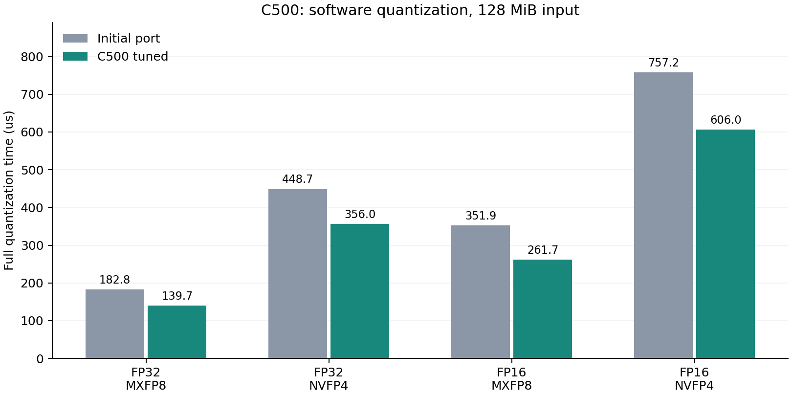

# MetaX C500 适配与性能报告

实测日期：2026-09-20（北京时间）。本报告使用同一台 C500 的优化前后数据；NVIDIA 历史结果单独保留。

## 环境与复现

单卡 MetaX C500，标称 64GB，104 个计算单元，原生 wave 为 64 线程。
实际环境为 Ubuntu 24.04.1、MACA SDK 3.3.0.15、驱动 3.8.30、Python 3.10.10、NumPy 1.26.4。CPU 配额为 12 核，内存 120GiB。以实测环境为准。
环境原始记录：[environment.txt](results/c500/environment.txt)、[device.json](results/c500/device.json)。

```bash
export MACA_PATH=/opt/maca
export LD_LIBRARY_PATH="$MACA_PATH/lib:${LD_LIBRARY_PATH:-}"
# 本次镜像的 NumPy 位于 /opt/conda；已配置 Python 的环境不需要此行。
export PATH="/opt/conda/bin:$PATH"
make PLATFORM=metax
mkdir -p results/c500
python3 tests/validate.py --binary build/metax/quantize --output results/c500/correctness.json
python3 tests/benchmark.py --binary build/metax/quantize --output-dir results/c500 --trials 3 --repeats 100
python3 tests/profile_metax.py
```

`PLATFORM=nvidia` 仍是默认值；C500 二进制单独放在 `build/metax/`。MACA 使用 cu-bridge 编译及运行时映射，不传 NVIDIA 架构参数。`make native` 是 NVIDIA 原生 FP8 对照，不用于 C500。

## 实现

- BF16 使用确定性 RNE 位转换，屏蔽 NVIDIA 专用 PTX；MXFP8/NVFP4 保持软件编码和原有文件协议。
- 量化保留 16/32 元素逻辑分组；C500 大张量每线程处理 8 个值，小于等于 65536 元素时使用标量 tile。FP32 全局最大值归约采用每线程 4 元素。
- 反量化按小张量、FP32 输出及 16 位输出分别选择启动配置。调参记录包含所有候选与重复测量：[quantization](results/c500/tune_vector.csv)、[amax](results/c500/tune_max.csv)、[dequantization](results/c500/tune_dequant.csv)。

## 正确性

独立 NumPy 参考验证 **182 个用例全部通过**。结果：[correctness.json](results/c500/correctness.json)。
覆盖 FP32/FP16 输入、FP32/FP16/BF16 输出、两种格式、块/张量缩放、最近偶数/随机舍入、奇数列与尾块、极小值/大值、码本中点及其两侧、65536 元素分派边界；另有 3 个错误文件拒绝测试。
本机 RTX 3060（ARCH=86）回归：182 个用例通过。记录：[NVIDIA regression](results/c500/correctness_nvidia_regression.json)。

## 性能

采用设备事件计时，先预热；每组 3 次独立试验，交替执行优化前后程序，取中位数。小规模每次重复 100 次，大规模重复 30 次。计时包含该流程的全部 GPU 步骤，排除文件 I/O、CPU 参考和主机传输。每次校验输出文件 SHA-256 一致。
对照基线：C500 initial port: NVIDIA launch geometry, software BF16。二进制校验和、逐次时间和输出哈希见 [comparison.json](results/c500/comparison.json)。



| 元素数 | 输入 | 格式 | 量化前 μs | 量化后 μs | 加速比 | 反量化后 μs（FP32） |
|---:|---|---|---:|---:|---:|---:|
| 32,768 | fp32 | mxfp8 | 7.47 | 3.80 | 1.97× | 3.45 |
| 32,768 | fp32 | nvfp4 | 26.19 | 23.53 | 1.11× | 3.70 |
| 1,048,576 | fp32 | mxfp8 | 12.68 | 12.50 | 1.01× | 9.15 |
| 1,048,576 | fp32 | nvfp4 | 41.81 | 40.73 | 1.03× | 9.51 |
| 32,768 | fp16 | mxfp8 | 7.29 | 3.91 | 1.87× | 3.35 |
| 32,768 | fp16 | nvfp4 | 25.94 | 23.07 | 1.12× | 3.49 |
| 1,048,576 | fp16 | mxfp8 | 12.46 | 12.03 | 1.04× | 9.27 |
| 1,048,576 | fp16 | nvfp4 | 39.98 | 38.02 | 1.05× | 9.34 |
| 33,554,432 | fp32 | mxfp8 | 182.84 | 139.67 | 1.31× | 123.39 |
| 33,554,432 | fp32 | nvfp4 | 448.74 | 356.04 | 1.26× | 128.55 |
| 67,108,864 | fp16 | mxfp8 | 351.88 | 261.73 | 1.34× | 240.59 |
| 67,108,864 | fp16 | nvfp4 | 757.22 | 605.95 | 1.25× | 252.39 |

大规模组输入均为 128MiB。反量化输出统一为 FP32，因此 FP16 输入组的输出为 256MiB；不能按输入大小直接计算反量化带宽。三种分布与块/张量缩放的完整结果另见 [benchmark.json](results/c500/benchmark.json)。

## 性能分析工具

已使用 MACA 自带 mcTracer 采集设备 kernel、运行时 API 和启动信息。原始 trace 与汇总位于 [profile/summary.json](results/c500/profile/summary.json)。分析器会扰动耗时，性能结论使用上面的未插桩事件计时；trace 只用于观察内核组成、启动配置和执行时间分布。

| trace 用例 | kernel | 次数 | 平均 μs（插桩） |
|---|---|---:|---:|
| mxfp8_fp16 | `quant_vector_kernel<0, 1, 8>` | 46 | 24.587 |
| mxfp8_fp16 | `dequant_vector_kernel<0, 1, 8>` | 46 | 18.349 |
| nvfp4_fp16 | `maximum_vector<1, 8>` | 46 | 19.373 |
| nvfp4_fp16 | `quant_vector_kernel<1, 1, 8>` | 46 | 28.828 |
| nvfp4_fp16 | `dequant_vector_kernel<1, 0, 4>` | 46 | 18.276 |

C500 的设备端内存检查本次未运行（镜像未提供可用工具）。NVIDIA 平台既有 Sanitizer 记录保留在 PROFILING.md 所列目录。
