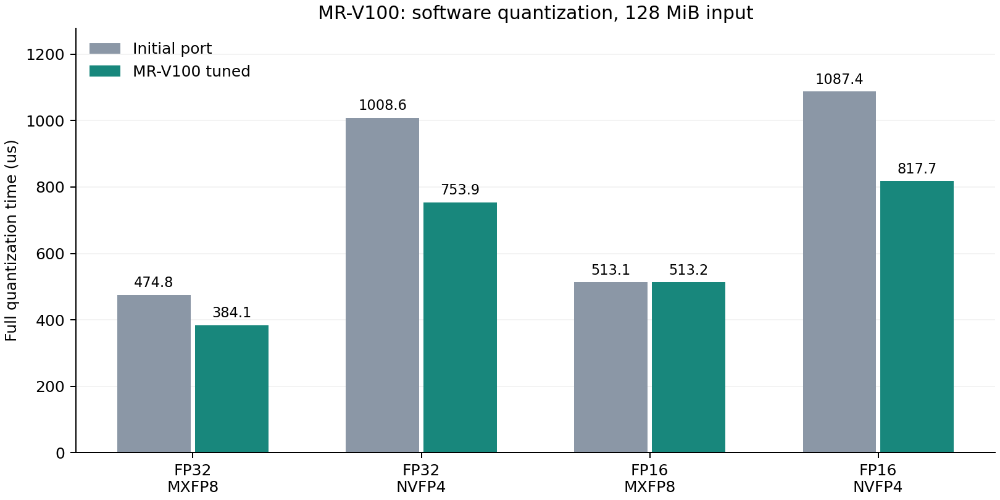

# Iluvatar 智铠 100（MR-V100）适配与性能报告

实测日期：2026-09-20。训练营 ID：曹泽阳；提交目录：`zmuxuny`。

## 环境与复现

单卡 Iluvatar MR-V100，32GiB 显存，16 个计算单元，原生 warp 为 64 线程。
Ubuntu 24.04.4、CoreX SDK / 驱动 4.4.0、Python 3.12、NumPy 1.26.4；CPU 配额 12 核，内存 32GiB。使用 CoreX clang 的 `-x ivcore --cuda-gpu-arch=ivcore11 -O3 -ffp-contract=off`。
[环境原始记录](results/iluvatar/environment.txt) · [设备属性](results/iluvatar/device.json)。

```bash
export COREX_PATH=/usr/local/corex
export LD_LIBRARY_PATH="$COREX_PATH/lib64:${LD_LIBRARY_PATH:-}"
make PLATFORM=iluvatar
make PLATFORM=iluvatar numeric-test
python3 tests/validate.py --binary build/iluvatar/quantize --output results/iluvatar/correctness.json
python3 tests/benchmark.py --binary build/iluvatar/quantize --output-dir results/iluvatar --trials 3 --repeats 100
python3 tests/profile_iluvatar.py
python3 tests/report_iluvatar.py
python3 tests/plot_iluvatar.py
```

默认 `PLATFORM=nvidia`；天数二进制单独存放在 `build/iluvatar/`。软件 FP8/FP4 编码及文件协议与其他后端相同，NVIDIA 专用 PTX 不进入 CoreX 编译路径。

## 设计

- 量化保留 32/16 元素逻辑缩放组；FP32/MXFP8 使用每线程 2 元素，较大 FP16/NVFP4 使用 8 元素。小张量独立选择启动配置，65536 元素分派边界有测试覆盖。
- 全局 amax 对 FP32 使用标量连续访问；16 位输入使用 4 元素向量及受限网格。计时包含清零、全局归约及最终量化。
- BF16 转换、负零符号和整数钳位同时支持 host/device。CoreX 4.4 在优化 lane 索引哈希时可错误复用移位结果；仅该哈希的设备局部变量使用 `volatile`，并以 49,152 次逐项测试覆盖线程边界、种子和超过 2³² 的索引。未改变随机序列或舍入语义。
- 向量宽度、线程数、归约网格扫描保留全部候选：[量化](results/iluvatar/tune_vector.csv)、[amax](results/iluvatar/tune_max.csv)、[反量化](results/iluvatar/tune_dequant.csv)。候选先校验输出一致，再比较未插桩计时。

## 验证

独立 NumPy 参考：**182 组全部通过**，见 [correctness.json](results/iluvatar/correctness.json)。
覆盖两种格式、FP32/FP16 输入、三种输出 dtype、块/张量缩放、最近偶数/随机舍入、中点/ULP、奇数列/尾块及非法文件；另有 3 组文件错误检查。
RTX 3060 / sm_86 完整回归 **182 组通过**：[记录](results/iluvatar/correctness_nvidia_regression.json)。设备/主机随机哈希的精确比较见 [numeric.log](results/iluvatar/numeric.log)。
设备检查：**12 次 ixsan 全部通过**，涵盖 memcheck、racecheck、initcheck；逐次命令、退出码、零错误汇总和二进制 SHA256 见 [检查汇总](results/iluvatar/profile/summary_sanitizer.json)。该工具未提供 synccheck。

## 性能对照

在同一张 MR-V100 上交替执行基线与当前版本，每项 3 次独立试验，取设备事件计时的中位数。预热 3 次，小规模重复 100 次，大规模重复 30 次。包含完整 GPU 流程，排除文件读写、主机传输和 CPU 参考。每次验证 packed SHA256 一致。
基线：MR-V100 correct initial port: NVIDIA launch geometry and vector amax。完整逐次时间与二进制哈希见 [comparison.json](results/iluvatar/comparison.json)；[initial_port.patch](results/iluvatar/initial_port.patch) 可在本目录副本中通过 `patch -p1 < results/iluvatar/initial_port.patch` 还原正确性已通过的初始移植源码，再执行 `make -B PLATFORM=iluvatar`。
基线和当前程序可用 `tests/benchmark_tuning.py --before <基线> --after <当前> --output <JSON> --trials 3` 重新比较。补丁包含该基线所需的构建和平台兼容代码。



| 元素数 | 输入 | 格式 | 量化基线 μs | 量化当前 μs | 加速比 | 当前反量化 μs（FP32） |
|---:|---|---|---:|---:|---:|---:|
| 32,768 | fp32 | mxfp8 | 8.43 | 7.79 | 1.08× | 4.74 |
| 32,768 | fp32 | nvfp4 | 15.28 | 13.92 | 1.10× | 4.72 |
| 1,048,576 | fp32 | mxfp8 | 19.80 | 18.82 | 1.05× | 10.23 |
| 1,048,576 | fp32 | nvfp4 | 44.48 | 33.09 | 1.34× | 10.30 |
| 32,768 | fp16 | mxfp8 | 8.01 | 7.69 | 1.04× | 4.72 |
| 32,768 | fp16 | nvfp4 | 14.60 | 13.81 | 1.06× | 4.68 |
| 1,048,576 | fp16 | mxfp8 | 15.54 | 15.46 | 1.01× | 10.23 |
| 1,048,576 | fp16 | nvfp4 | 33.26 | 25.98 | 1.28× | 10.33 |
| 33,554,432 | fp32 | mxfp8 | 474.79 | 384.10 | 1.24× | 292.69 |
| 33,554,432 | fp32 | nvfp4 | 1008.59 | 753.93 | 1.34× | 281.77 |
| 67,108,864 | fp16 | mxfp8 | 513.13 | 513.24 | 1.00× | 580.43 |
| 67,108,864 | fp16 | nvfp4 | 1087.42 | 817.70 | 1.33× | 559.01 |

大尺寸输入均为 128MiB；反量化统一输出 FP32，因此 FP16 输入组产生 256MiB 输出。FP16/MXFP8 大尺寸主要保留原有配置，收益有限；按格式分别报告，不能套用 NVFP4 加速比。三种分布及块/张量缩放的结果见 [benchmark.json](results/iluvatar/benchmark.json)。

## Profiler

ixsys 原生时间线与 ixkn 硬件计数器均已采集。以下为插桩统计，不能与上面未插桩基准直接比较：[时间线](results/iluvatar/profile/summary_trace.json)、[计数器](results/iluvatar/profile/summary_counters.json)、[机器可读分析](results/iluvatar/profile/analysis.json)。

| 用例 | kernel | 次数 | 平均 μs（插桩） |
|---|---|---:|---:|
| trace_mxfp8_fp32 | `dequant_vector_kernel<0, 1, 8>` | 12 | 10.802 |
| trace_mxfp8_fp32 | `quant_vector_kernel<0, 0, 2>` | 12 | 20.493 |
| trace_nvfp4_fp32 | `maximum` | 12 | 12.136 |
| trace_nvfp4_fp32 | `dequant_vector_kernel<1, 0, 4>` | 12 | 11.354 |
| trace_nvfp4_fp32 | `quant_vector_kernel<1, 0, 4>` | 12 | 22.526 |
| trace_mxfp8_fp16 | `dequant_vector_kernel<0, 1, 8>` | 12 | 10.931 |
| trace_mxfp8_fp16 | `quant_vector_kernel<0, 1, 4>` | 12 | 16.977 |
| trace_nvfp4_fp16 | `dequant_vector_kernel<1, 0, 4>` | 12 | 11.443 |
| trace_nvfp4_fp16 | `maximum_vector<1, 4>` | 12 | 8.413 |
| trace_nvfp4_fp16 | `quant_vector_kernel<1, 1, 8>` | 12 | 19.067 |

| 计数器用例 / kernel | TCU 效率 | 实测占用率 | 矩阵指令数 |
|---|---:|---:|---:|
| counters_mxfp8_fp32 / quant_vector_kernel | 0.0000 % | 74.44 % | 0 Instructions |
| counters_mxfp8_fp32 / dequant_vector_kernel | 0.0000 % | 51.53 % | 0 Instructions |
| counters_nvfp4_fp32 / quant_vector_kernel | 0.0000 % | 74.60 % | 0 Instructions |
| counters_nvfp4_fp32 / dequant_vector_kernel | 0.0000 % | 68.88 % | 0 Instructions |
| counters_nvfp4_fp32 / maximum | 0.0000 % | 39.21 % | 0 Instructions |
| counters_mxfp8_fp16 / quant_vector_kernel | 0.0000 % | 73.01 % | 0 Instructions |
| counters_mxfp8_fp16 / dequant_vector_kernel | 0.0000 % | 63.47 % | 0 Instructions |
| counters_nvfp4_fp16 / quant_vector_kernel | 0.0000 % | 70.68 % | 0 Instructions |
| counters_nvfp4_fp16 / dequant_vector_kernel | 0.0000 % | 70.26 % | 0 Instructions |
| counters_nvfp4_fp16 / maximum | 0.0000 % | 44.34 % | 0 Instructions |

计数器结果来自单次 kernel replay；指令计数用于核实矩阵路径，占用率用于观察当前启动配置，不单独作为速度判断依据。
