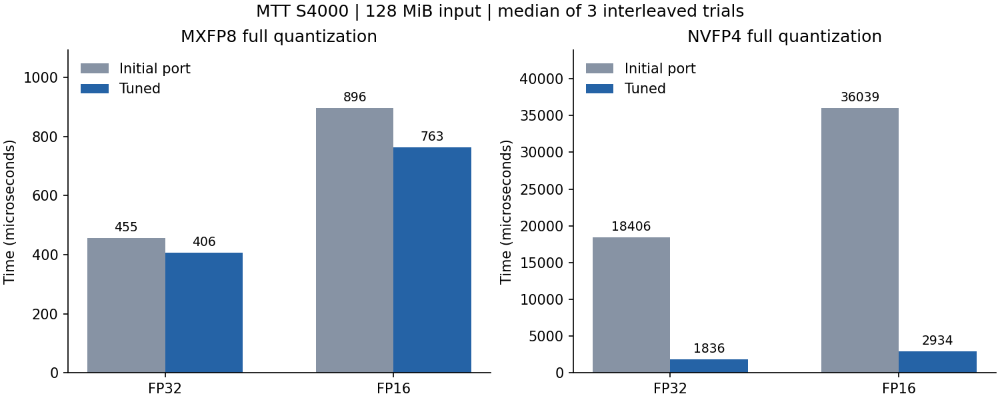

# Moore Threads MTT S4000 适配与性能报告

实测日期：2026-09-20。训练营 ID：曹泽阳；提交目录：`zmuxuny`。

## 环境与复现

单卡 MTT S4000，48GB 显存、64 个计算单元；MUSA SDK / mcc 4.3.6，目标 `mp_22`。`mthreads-gmi` 的驱动字符串为 `3.3.5-server`，运行时查询为 4.3。使用 `MUSA_VISIBLE_DEVICES=0` 固定单卡。设备属性报告物理 wave 为 128 线程；编译器 shuffle 接口使用 32 线程逻辑组，矩阵指令覆盖 128 线程。[环境记录](results/musa/environment.txt)、[SDK 版本](results/musa/sdk_version.json)。

```bash
export MUSA_PATH=/usr/local/musa
export MUSA_VISIBLE_DEVICES=0
export LD_LIBRARY_PATH="$MUSA_PATH/lib:${LD_LIBRARY_PATH:-}"
make PLATFORM=musa
make PLATFORM=musa numeric-test
python3 tests/validate.py --binary build/musa/quantize --output results/musa/correctness.json
python3 tests/profile_musa.py
python3 tests/report_musa.py
```

源文件直接由 mcc 编译；`include/platform.cuh` 显式映射运行时 API，NVIDIA PTX 与 MUSA 矩阵实现分别编译。默认仍为 NVIDIA 构建，MUSA 二进制独立存放。

## 数值实现

- 软件 E4M3 / E2M1 编码、缩放、随机舍入与文件格式保持一致。编译开启精确除法并关闭浮点收缩。
- S4000 普通 FP32 乘法会将极小乘积冲为零。`multiply_rn` 对罕见下溢情况使用精确的 24×24 位整数乘积，并执行一次最近偶数舍入；正规乘积继续使用硬件。E8M0 最小/最大缩放也走保留极小值的路径。
- NVFP4 的 `divide_rn` 先构造快速商，再用 FMA 残差检验商的舍入区间。区间边界为分母乘 2 的幂，所选范围内精确可表示；只有严格落在区间内部才接受结果。中点、极端指数和未通过检验的候选退回 SDK 精确除法。
- MUSA 4.3.6 对部分尾块中 shuffle 后缩放值的零值判断存在优化问题；仅将该 NVFP4 解码结果物化为设备局部 `volatile`，避免错误折叠。相关奇数列、全零块与尾块均有独立参考测试。

## 验证

独立 NumPy 参考：**182 组全部通过**；[原始结果](results/musa/correctness.json)。另有 3 组非法文件检查；覆盖两种格式、输入/输出 dtype、块/张量缩放、最近偶数/随机舍入、码本中点与相邻 ULP、负零、FP32 极小值、奇数列及分派边界。

设备与主机精确对照：**49,152 项随机哈希、65,536 项乘法、1,048,576 项除法全部通过**。测试包含符号、指数边界、正规数/次正规数和幂次值；[日志](results/musa/numeric.log)。同一份公共代码在本机 RTX 3060 / sm_86 完成全套回归：[结果](results/musa/correctness_nvidia_regression.json)。

## 性能测量

基线为本卡上正确性验证通过的初始移植：保留 SDK 精确除法、初始启动配置及软件数值兼容处理。当前版本采用带区间校验的除法及实测选择的启动配置。通过 `tests/benchmark_tuning.py` 同机交替执行，每项 3 次独立试验取中位数；预热 3 次，小尺寸重复 100 次，大尺寸重复 30 次。采用未插桩 MUSA event 计时，包含各完整 GPU 流程，排除文件读写、主机传输和 CPU 参考。每次检查 packed SHA256 一致。[全部逐次记录](results/musa/comparison.json)。

基线和当前二进制 SHA256：

```text
before: 17570c7d056720427051684b103fc71fb7e2545e2259a1e0d744800a6d606d59
after: bb09bf004ba4326d9355ce5b1e4a71723ef896d05bf527cd5dc88232e4aef50f
```

可在本目录副本中执行 `patch -p1 < results/musa/initial_port.patch` 还原基线，再 `make -B PLATFORM=musa`。补丁仅用于独立副本。



| 行数（列数 1024） | 输入 / 格式 | 初始量化 μs | 当前量化 μs | 加速比 | 当前反量化 μs |
|---:|---|---:|---:|---:|---:|
| 32 | fp32 / mxfp8 | 15.68 | 10.60 | 1.48× | 8.27 |
| 32 | fp32 / nvfp4 | 222.28 | 104.75 | 2.12× | 27.89 |
| 1,024 | fp32 / mxfp8 | 30.09 | 27.55 | 1.09× | 24.11 |
| 1,024 | fp32 / nvfp4 | 732.90 | 171.27 | 4.28× | 45.96 |
| 32 | fp16 / mxfp8 | 16.07 | 10.33 | 1.56× | 8.29 |
| 32 | fp16 / nvfp4 | 220.05 | 104.00 | 2.12× | 28.71 |
| 1,024 | fp16 / mxfp8 | 29.81 | 27.09 | 1.10× | 23.59 |
| 1,024 | fp16 / nvfp4 | 730.72 | 167.95 | 4.35× | 45.81 |
| 32,768 | fp32 / mxfp8 | 455.11 | 406.42 | 1.12× | 428.75 |
| 32,768 | fp32 / nvfp4 | 18406.49 | 1835.51 | 10.03× | 574.46 |
| 65,536 | fp16 / mxfp8 | 896.33 | 762.82 | 1.18× | 838.67 |
| 65,536 | fp16 / nvfp4 | 36038.70 | 2933.58 | 12.28× | 1086.35 |

最后四组输入为 128MiB；反量化统一输出 FP32，FP16 输入对应 256MiB 输出。NVFP4 的完整量化计时包含清零与全局 amax，表中加速比相对于本卡正确初始移植。

小张量使用标量 tile，中等张量使用每线程 4 值与 512 线程 CTA，大张量使用每线程 8 值与 128 线程 CTA。amax 按 dtype/规模选取向量宽度及网格；反量化按输出 dtype/规模选择配置。

扫描记录：[量化](results/musa/tune_vector.csv)、[amax](results/musa/tune_max_initial.csv)、[反量化](results/musa/tune_dequant_initial.csv)。向量候选与同一输入的参考输出比较后记录时间；标量对照另由完整正确性测试覆盖。

## 分布实验与路径结论

标准 `tests/benchmark.py` 另以 3 次独立试验、每次 30 次重复采样，记录在 [benchmark.json](results/musa/benchmark.json)。量化覆盖均匀、正态、离群点三种分布，FP32/FP16 输入，两种格式及块/张量缩放。

## MUPTI 与工具记录

- `mxfp8_fp32`：24 条 kernel 记录，0 条有效时间戳，状态 `UNAVAILABLE_TIMESTAMPS`。
- `nvfp4_fp32`：36 条 kernel 记录，0 条有效时间戳，状态 `UNAVAILABLE_TIMESTAMPS`。
- `mxfp8_fp16`：24 条 kernel 记录，0 条有效时间戳，状态 `UNAVAILABLE_TIMESTAMPS`。
- `nvfp4_fp16`：36 条 kernel 记录，0 条有效时间戳，状态 `UNAVAILABLE_TIMESTAMPS`。

本镜像 MUPTI 返回 kernel 活动记录，但起止时间为零；原始日志提示未能在时限内收到 mt-perf 硬件事件。这些记录用于保留采样尝试与启动信息，不计入性能加速比；未获得可用的硬件计数器。镜像未提供可用 MUSA 设备端 Sanitizer。[采样命令、状态和二进制哈希](results/musa/profile/summary.json)、[工具复现入口](PROFILING.md)。

## 复核材料

代码旁注明线程组、fragment 坐标、舍入语义与平台兼容处理；原始数据保存在 `results/musa/`，源码 SHA256 清单见 [source_sha256.json](results/musa/source_sha256.json)。旧平台归档结果对应各自原始环境；本轮公共代码回归在 S4000 与 RTX 3060 完成。
