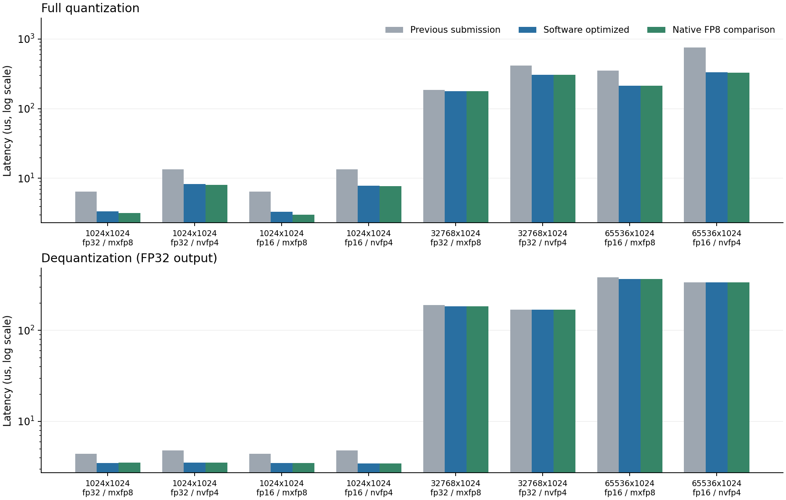

# RTX 4090 D 第二轮优化

实测日期：2026-09-19。本轮基线是第一轮已经提交的版本 `1f259ef`，不是最初版本。RTX 4090 D 24 GiB、CUDA 12.8、GCC 13、`sm_89`；编译保留 `--fmad=false`。默认程序继续使用软件 FP8/FP4 编码，可选 `_native` 程序使用 Ada 原生 E4M3 最近偶数转换。两者分别测试、分别计时。

## 测量与正确性

每组使用同一份 seed=42 正态输入，旧版、当前软件版、原生转换对照轮换执行顺序，各运行 3 个独立进程，报告中位数；每进程预热 3 次，小中张量重复 100 次，大张量重复 30 次。CUDA event 时间包括对应流程的全部 GPU 步骤，NVFP4 包括清零与全局最大值归约，不包括 CPU 参考、I/O、分配与传输。GPU 未锁频。大张量输入为 128 MiB，超过 72 MiB L2；小张量的结果可能受缓存影响。

[完整原始试验](results/4090d/tuning/comparison.json) 保留各次测量、可执行文件 SHA256 和 packed 文件 SHA256；每个配置的所有程序、所有重复均检查 packed 文件一致。题目 2 本轮统一使用 FP32 反量化输出；第一轮大张量报告沿用预设，MXFP8 输出 FP16、NVFP4 输出 FP32，所以不能跨两份报告直接相除反量化耗时。

- 当前软件版：158 组正确性测试通过；详见 [correctness.json](results/4090d/tuning/correctness.json)。
- 原生 FP8 对照：158 组正确性测试通过；详见 [correctness_native.json](results/4090d/tuning/correctness_native.json)。
- RTX 3060 / CUDA 11.5 兼容版：158 组正确性测试通过；详见 [compatibility_3060.json](results/4090d/tuning/compatibility_3060.json)。
- 每个测试集另含 3 组无效文件检查；边界覆盖所有 FP8 中点及相邻 ULP、所有正 E4M3 scale 下的 FP4 中点及相邻 ULP、奇数列、自定义块长、超过 65535 行、极大/极小输入和随机舍入。


软件 E4M3 最近偶数舍入在正规数区间使用 `bits + 0x7ffff + retained_lsb` 后移位；尾数进位自然进入指数。次正规区间以精确二次幂缩放后做整数最近偶数转换，符号与负零单独保留。随机舍入仍按原概率与元素索引计算。该变更减少了量化和融合输出的标量指令，已由独立 NumPy 码本验证。


软件版另测均匀分布、正态分布和异常值输入，覆盖 FP32/FP16、两种格式及 block/tensor 缩放，共 24 组配置；[完整数据](results/4090d/tuning/benchmark_modes.json) 保留每次耗时、CPU/GPU 含传输时间和误差指标。所有误差指标与第一轮相同。


## 完整流程性能

单位 μs，‘量化’为完整 GPU 量化流程；反量化统一输出 FP32。

| 输入 / dtype | 格式 | 量化：旧 / 软件 / 原生 FP8 | 软件量化加速 | 反量化：旧 / 软件 | 反量化加速 |
| --- | --- | --- | --- | --- | --- |
| 32×1024 / fp32 | mxfp8 | 2.05 / 2.12 / 2.09 | 0.97× | 2.04 / 2.06 | 0.99× |
| 32×1024 / fp32 | nvfp4 | 5.54 / 5.57 / 5.49 | 0.99× | 2.06 / 2.07 | 0.99× |
| 1024×1024 / fp32 | mxfp8 | 6.47 / 3.36 / 3.16 | 1.93× | 4.42 / 3.50 | 1.26× |
| 1024×1024 / fp32 | nvfp4 | 13.54 / 8.25 / 8.10 | 1.64× | 4.81 / 3.51 | 1.37× |
| 32×1024 / fp16 | mxfp8 | 2.07 / 2.08 / 2.05 | 1.00× | 2.06 / 2.05 | 1.01× |
| 32×1024 / fp16 | nvfp4 | 5.57 / 5.48 / 5.45 | 1.02× | 2.08 / 2.06 | 1.01× |
| 1024×1024 / fp16 | mxfp8 | 6.45 / 3.30 / 3.03 | 1.96× | 4.42 / 3.48 | 1.27× |
| 1024×1024 / fp16 | nvfp4 | 13.53 / 7.80 / 7.71 | 1.73× | 4.81 / 3.44 | 1.40× |
| 32768×1024 / fp32 | mxfp8 | 186.37 / 178.41 / 178.18 | 1.04× | 189.78 / 184.18 | 1.03× |
| 32768×1024 / fp32 | nvfp4 | 415.40 / 304.30 / 304.26 | 1.37× | 168.82 / 168.86 | 1.00× |
| 65536×1024 / fp16 | mxfp8 | 349.18 / 212.92 / 212.99 | 1.64× | 381.10 / 367.99 | 1.04× |
| 65536×1024 / fp16 | nvfp4 | 752.06 / 332.19 / 329.66 | 2.26× | 338.16 / 337.44 | 1.00× |

## 设计与消融

默认块对齐输入改为每线程处理 4 个元素、128 线程/CTA。FP32 使用 float4 读取，FP16 使用打包向量读取；在更小的 warp 子组中计算块 amax，打包后连续写出。非整块、奇数列和自定义块长仍使用已验证的通用路径。随机数继续按元素线性索引生成，线程映射变化不会改变随机舍入结果。

反量化 FP32 输出采用每线程 4 元素、256 线程/CTA；FP16/BF16 输出采用每线程 8 元素、128 线程/CTA。全局 amax 使用每线程 8 元素的向量加载、256 线程/CTA，最多 512 个 CTA，最后每 CTA 只做一次原子最大值更新；不满向量的尾部单独读取。

[量化扫描](results/4090d/tuning/tune_vector.csv)、[反量化扫描](results/4090d/tuning/tune_dequant.csv)、[amax 扫描](results/4090d/tuning/tune_max.csv) 保留不同向量宽度、线程块和归约网格的 3 次测量。量化扫描的 kernel 时间不包含 NVFP4 全局归约；正文表格包含它，二者加速比不能混用。

[复制带宽对照](results/4090d/tuning/copy_ceiling.csv) 在 128 MiB 输入上测得 SM 向量复制约 924 GB/s、cudaMemcpy D2D 约 945 GB/s，按读+写逻辑字节计算。FP32 MXFP8 大张量量化已接近该逻辑带宽数量级，进一步减少编码计算的收益较小；这不是硬件 DRAM 利用率或绝对性能上限。只有 64 MiB 的 FP16 amax 微基准输入可放进 L2，不能将其加速直接外推到 128 MiB 完整流程。


## 可选原生 FP8 对照

默认 `make` 仍构建软件 E4M3/E2M1 编码。额外执行 `make native ARCH=89` 可生成独立的 `_native` 程序，要求 CUDA >=12.1 和 sm_89 或更新；两路可以同时存在。原生对照使用 `cvt.rn.satfinite.e4m3x2.f32` 一次转换两个相邻值，低/高字节顺序与 packed 格式一致。随机舍入沿用软件编码，NVFP4 的 E2M1 数据仍由软件编码，只有 E4M3 scale 可用原生转换。日志 `fp8_encoding` 明确区分两路。

指令与架构依据：[NVIDIA PTX ISA](https://docs.nvidia.com/cuda/parallel-thread-execution/index.html#data-movement-and-conversion-instructions-cvt)。这个对照不替代题目 2 的软件实现，也不是 FP8/FP4 Tensor Core 矩阵乘法。

## Profiler 与 Sanitizer

- 软件版：memcheck、racecheck、synccheck 共 24 次全部通过；[原始日志与退出码](results/4090d/tuning/software/profiling.json)。
- 原生对照：memcheck、racecheck、synccheck 共 24 次全部通过；[原始日志与退出码](results/4090d/tuning/native/profiling.json)。

两种格式、两路实现均采集 Nsight Systems 时间线，见各 `software/`、`native/` 下的 `timeline_*.nsys-rep` 和 `nsys_stats_*.csv`。分析使用无插桩 event 时间；时间线用于确认 kernel 与启动次数。Nsight Compute 仍因宿主机 `ERR_NVGPUCTRPERM` 无法访问计数器，未把静态资源或逻辑带宽冒充硬件 occupancy、DRAM 或 stall 测量。



## 复现

```bash
make clean
make all native ARCH=89 NVCC=/usr/local/cuda/bin/nvcc HOSTCXX=g++
mkdir -p results/4090d/tuning
python3 tests/validate.py --output results/4090d/tuning/correctness.json
python3 tests/validate.py --binary build/quantize_native --output results/4090d/tuning/correctness_native.json
python3 tests/benchmark_tuning.py --before /path/to/first-optimized/quantize --after build/quantize --native build/quantize_native --output results/4090d/tuning/comparison.json
python3 tests/profile_native.py --output results/4090d/tuning/software
python3 tests/profile_native.py --binary build/quantize_native --output results/4090d/tuning/native
python3 tests/report_tuning.py
```

微基准用 `nvcc -std=c++17 -O3 --fmad=false -lineinfo -arch=sm_89` 编译 `tests/tune_*.cu` 后直接运行即可输出 CSV；题目 3 另加 `-DLP_CUDA_ARCH=89`。BF16 位模式检查位于题目 3 的 `tests/check_bf16.cu`。测试和采样顺序执行，不与其他 GPU 负载并发。第一轮完整结果保留在 [REPORT_4090D.md](REPORT_4090D.md)，本轮环境与源代码/二进制指纹见 [environment.json](results/4090d/tuning/environment.json)。
