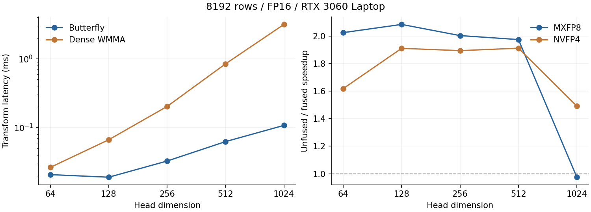

# 题目 3 总结报告：Hadamard 加速与量化融合

> 本文保留首版 RTX 3060 Laptop 实验与实现说明。当前优化实现、4090 D 同机前后对比和工具检查见 [RTX 4090 D 优化报告](REPORT_4090D.md)。

作者：zmuxuny

## 完成结果

实现 FP16/BF16、头维度 1–1024 的快速 Walsh-Hadamard 变换，以及与 MXFP8/NVFP4 的量化融合。默认采用归一化 Sylvester 顺序；支持可复现随机符号旋转、nearest/stochastic 舍入。FP16 另提供实际使用 Tensor Core 的 WMMA 对照。常用头维度的融合路径减少了 kernel 启动和中间张量流量，同时保持 packed 数据与分步实现逐字节一致。

实测日期：2026-09-19。GPU：RTX 3060 Laptop 6 GiB（sm_86）；CPU：Ryzen 7 6800H，WSL 分配 8 个逻辑 CPU；系统：Ubuntu / WSL2；CUDA Toolkit 11.5、GCC 10.5、驱动 576.80。编译目标为 sm_75 + compute_75 PTX，使用 `-O3 --fmad=false -lineinfo`，未启用 fast-math。完整环境记录见 `results/environment.json`。

## 算法与实现

输入逻辑形状为 `[B,S,H,D]`，前三维展平，逐行计算 `y=x H_D / sqrt(D)`。通过 `--normalize 0` 可输出未归一化结果。随机旋转采用 `y=(x R)H_D/sqrt(D)`，R 是以 `sign_seed` 决定的对角 ±1 矩阵，同一维度的符号对所有行相同。

蝶形实现每个 warp 负责一行，CTA 有 4 个 warp。前五级通过 `__shfl_xor_sync` 交换同一 warp 内的值；D>32 时，每个 lane 持有多个寄存器元素，其余蝶形级在寄存器之间进行。中间累加为 FP32，最终舍入回输入 FP16/BF16。复杂度为 O(D log D)，无中间全局内存读写，也不需要 CTA 级共享内存屏障。

MXFP8 融合将变换结果在寄存器中舍入回目标 dtype，再计算 32 元素块最大值、E8M0 缩放和 E4M3 编码，一次 kernel 写出 scales 和 packed data。NVFP4 使用 16 元素局部块和张量级全局 scale，必须先获知变换后张量 amax。因此先运行不写中间张量的变换归约 kernel，再运行变换和打包融合 kernel；计时包含两遍变换和 amax 清零，未隐藏预处理开销。

保留中间 dtype 舍入是融合等价性的关键：如果直接量化尚未舍入的 FP32 寄存器值，量化中点附近可能与“保存 FP16/BF16 再量化”得到不同码值。两条路径使用同一线性索引生成随机舍入值，避免线程布局改变随机结果。NVFP4 由偶数 lane 收集相邻 lane 的 4 bit 码并写出一个字节，避免并发更新半字节。

## Tensor Core 路径

WMMA 使用 16×16×16 FP16 输入、FP32 累加，显式构造 ±1 Hadamard 矩阵并计算稠密 XH。尾部不足 16 行通过共享内存 tile 补零；WMMA tile 显式按 32 字节对齐。实现不调用 cuBLAS 或外部 Hadamard 库。

`cuobjdump` 确认生成 `HMMA.1688.F32`，见 [指令摘录](results/tensor_core_instructions.txt)。该路径仅支持 FP16；BF16 使用蝶形路径。本项目比较的是 O(D²) 稠密 WMMA 与 O(D log D) 蝶形，Tensor Core 的吞吐优势需要抵消额外运算量，不能仅凭使用 Tensor Core 就推断加速。

## 正确性验证

独立 NumPy oracle 显式构造 float64 Sylvester 矩阵，以矩阵乘法计算参考，避免与 CUDA 蝶形实现同源。共通过 **44** 组测试及 1 组非法头维度检查，覆盖 FP16/BF16、全部支持维度、两种融合格式、非整 CTA 行数、零行、脉冲、随机符号和归一化选项。

- FP16 最大绝对误差：**0.0078125**，低于 1e-2。
- BF16 最大绝对误差：**6.10351562e-05**，低于 5e-2。
- 所有融合结果的 global scale、局部 scales 和 packed data 与非融合结果逐字节一致，并通过独立码本参考复核。
- FP16 Tensor Core 输出也与独立参考比较，满足相同阈值。

完整记录见 [correctness.json](results/correctness.json)。量化编码在开发中发现的 FP8 中点一 ULP 问题已在本题随附的编码模块修正；该编码版本也通过题目 2 的穷举边界测试。

## 性能实验

每个配置 3 次独立进程运行，每次预热 3 次、CUDA event 计时 100 次，表中列出各指标的三次运行中位数。加速比先在每次运行中计算，再取中位数，因此未必等于表中两个时间中位数之比。使用默认 stream、常驻设备缓冲区；GPU 时钟未锁定，桌面与 WSL 调度会影响短 kernel。CPU 为本项目单线程参考；传输计时不含文件 I/O、分配、参考验证和写盘。

8192 行、FP16、MXFP8 融合结果如下，单位均为 ms：

| D | 蝶形变换 | 稠密 WMMA | 变换后量化 | 融合 | 融合加速 |
| --- | --- | --- | --- | --- | --- |
| 64 | 0.0208 | 0.0264 | 0.0578 | 0.0298 | 2.03× |
| 128 | 0.0190 | 0.0666 | 0.1123 | 0.0532 | 2.09× |
| 256 | 0.0327 | 0.2031 | 0.1851 | 0.0932 | 2.00× |
| 512 | 0.0626 | 0.8440 | 0.3451 | 0.1747 | 1.98× |
| 1024 | 0.1077 | 3.1527 | 0.6818 | 0.7003 | 0.97× |

本机上，大批量的稠密 WMMA 对照慢于蝶形，差距随 D 增大。该结果与两者运算复杂度差异一致。后续 Tensor Core 优化应把 Hadamard 因式分解成较小的矩阵变换，并复用 tile，而非扩大稠密 H 矩阵。

NVFP4 融合结果（已包含全局缩放所需预处理）：

| dtype | D | 分步 ms | 融合 ms | 加速 | packed 一致 |
| --- | --- | --- | --- | --- | --- |
| fp16 | 64 | 0.1040 | 0.0615 | 1.62× | 1 |
| fp16 | 128 | 0.1983 | 0.1006 | 1.91× | 1 |
| fp16 | 256 | 0.3045 | 0.1606 | 1.90× | 1 |
| bf16 | 64 | 0.1060 | 0.0565 | 1.87× | 1 |
| bf16 | 128 | 0.1904 | 0.1088 | 1.74× | 1 |
| bf16 | 256 | 0.3786 | 0.1606 | 1.93× | 1 |

常用头维度 64/128/256 的融合收益稳定存在；D=1024 的 MXFP8 融合没有收益。较大 D 增加每线程持有的中间值，并扩大编码路径，寄存器压力和访存行为是后续需要硬件计数器验证的方向；当前没有将这一推测写成已测得的瓶颈。

包括数据传输的变换耗时，与 CPU float64 蝶形参考比较：

| 行数 | D | CPU ms | GPU 含传输 ms | 加速比 |
| --- | --- | --- | --- | --- |
| 32 | 64 | 0.038 | 0.119 | 0.32× |
| 8192 | 64 | 10.186 | 0.463 | 22.61× |
| 8192 | 128 | 20.730 | 0.677 | 30.98× |
| 8192 | 256 | 44.245 | 1.157 | 38.23× |

小批量会被传输和启动开销主导，可能慢于 CPU；8192 行的主要测试中 GPU 整体更快。CPU 使用 float64 中间量验证精度，GPU 使用 FP32 中间量，该加速比针对项目参考基线。全部 dtype、维度和三次试验见 [benchmark.json](results/benchmark.json)。

## 旋转与重建误差

实验取 1024×128 FP16 输入，比较直接量化与“随机旋转→量化→反变换”。反变换回原坐标系后计算 MSE，避免比较不同基底的元素。使用块量化和默认块长，结果为：

| 分布 | 格式 | 直接量化 MSE | 旋转后重建 MSE | 后/前 |
| --- | --- | --- | --- | --- |
| normal | mxfp8 | 0.000714755 | 0.000715874 | 1.002 |
| normal | nvfp4 | 0.00912241 | 0.00903669 | 0.991 |
| outliers | mxfp8 | 0.00203956 | 0.0025513 | 1.251 |
| outliers | nvfp4 | 0.0185736 | 0.0442362 | 2.382 |

在本组细粒度块量化样本上，旋转未稳定改善精度。异常值能量扩散后可能影响更多局部量化块；原始块缩放已能隔离异常值，这使“扩散异常值”与“限制异常值影响范围”产生不同取舍。此实验展示的是实际输入分布和缩放配置的结果，不推导所有低比特场景均会恶化或改善。

## 工具与可移植性

已尝试新版 Compute Sanitizer 2025.2.1（CUDA 12.9 配套），但 Windows 侧 WDDM 调试接口未启用，工具要求管理员运行 EnableDebuggerInterface.bat，并在 kernel 检查前退出。此次未取得 sanitizer 检查通过结果。原始命令和输出保存在 `results/{memcheck,racecheck,synccheck}.txt`。

当前 Nsight Compute 2021.3.1 在设备检查阶段明确报告不支持本机 WSL，未取得硬件计数器数据。`results/ncu.txt` 保留原始错误；本文带宽是逻辑字节数除以 CUDA event 时间，不据此宣称达到某个 DRAM 利用率。可在支持的分析环境运行 `python3 tests/profile.py --ncu /path/to/ncu --sanitizer /path/to/compute-sanitizer` 重现。

蝶形和软件量化以 sm_75 构建，未使用 Ampere 以上的特性；FP16 WMMA 对照需要 Tensor Core。未在 T4 实机或国产 GPU 上验证，因此报告仅记录 RTX 3060 本机性能。未来可增加更细粒度的 Tensor Core 分解、按维度选择融合策略，并在训练营平台测量硬件计数器和实际带宽。

## 复现与提交

本目录运行 `make && python3 tests/validate.py && python3 tests/benchmark.py`。运行 `python3 tests/report.py` 重建本题报告。量化编码、文件模块与参考实现均在本题目录内，不依赖另一个 PR。详细 CLI 与输入文件协议见 [README](README.md)。
