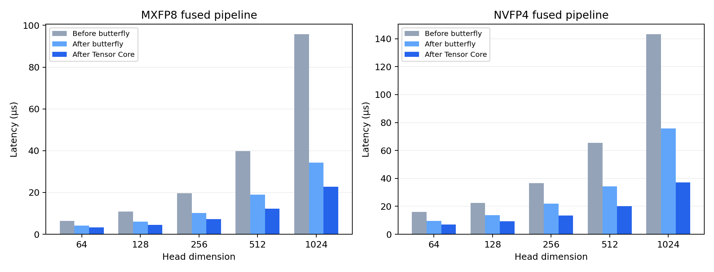

# RTX 4090 D 优化实验

本页为第一轮已归档结果。最新实现与第二轮对比见 [REPORT_TUNING.md](REPORT_TUNING.md)。

实测日期：2026-09-19。基线为本题首版提交 `0a5e40b`（与实际构建的本地集成快照 `deba5cb` 对应目录完全相同），优化前后均在同一台 RTX 4090 D 24 GiB 上执行。CUDA 12.8、驱动 570.124.06、GCC 13，编译目标 `sm_89`，使用 `-O3 --fmad=false -lineinfo`。环境和基线可执行文件 SHA256 见 [environment.json](results/4090d/environment.json)。

## 测量方法

常规基准每配置运行 3 个独立进程，每进程预热 3 次、CUDA event 重复 100 次，取时间中位数。大张量每配置同样 3 次，重复 30 次；优化前后进程交替运行以减少温度与时钟漂移的影响。GPU 未锁频。表内加速比统一按两个时间中位数之比计算。

kernel 计时不含文件 I/O、CPU 参考、设备分配和传输；NVFP4 的计时包含全局 amax 清零、归约和输出阶段。输入驻留设备且重复访问，常规尺寸可能受 L2 缓存加速，因此另测单个输入即为 128 MiB 的大张量。有效 GB/s 是逻辑读写量除以时间，不作为 DRAM 利用率。

## 算法与实现

原始 WMMA 对照对整个 D×D Hadamard 矩阵做稠密乘法，复杂度为 O(D²)。新路径利用 `H_D = H_(D/16) ⊗ H_16`：把连续 16 个值作为一个 segment，两条 `mma.sync.m16n8k16` 完成 16 个 segment 的 H16 变换，其余维度在 FP32 寄存器内通过 shuffle 与蝶形加减合并。无需在全局内存构造完整 Hadamard 矩阵，整体仍为 O(D log D)。

FP16 和 BF16 各使用原生对应类型的 MMA 指令，均 FP32 累加。D≤256 时一个 warp 同时覆盖多行；D>256 时一个 warp 覆盖一行。lane/寄存器布局依据 [NVIDIA PTX m16n8k16 文档](https://docs.nvidia.com/cuda/parallel-thread-execution/index.html#warp-level-matrix-fragment-mma-16816-float)，实现位于 `src/tensor_core.cuh`。目标要求 `ARCH>=80`；默认 sm_75 构建保留蝶形和 FP16 稠密 WMMA。

Tensor Core 融合直接从 MMA 的 FP32 寄存器计算块 scale 和 packed data，省去中间张量写回/重读。保留与输入 dtype 一致的中间舍入，独立比较“Tensor Core 变换→量化”与“Tensor Core 融合”的完整 packed 结果。蝶形和 MMA 的浮点求和顺序不同，各自与 float64 参考校验，而不要求两个算法的 packed 字节相同。

NVFP4 保留变换后全局 amax 预遍历，表中时间包含这一遍、清零和第二次变换。预遍历采用 CTA 内分层归约减少原子更新；MXFP8 只需单 kernel。蝶形融合同时加入格式专门化与精确二次幂缩放。

## 常规尺寸：8192 行，FP16

| D | 格式 | 初版蝶形融合 μs | 新蝶形融合 μs | 新 Tensor Core 融合 μs | TC 相对初版 | TC 相对新蝶形 |
| --- | --- | --- | --- | --- | --- | --- |
| 64 | mxfp8 | 6.451 | 4.137 | 3.205 | 2.01× | 1.29× |
| 64 | nvfp4 | 15.872 | 9.656 | 6.912 | 2.30× | 1.40× |
| 128 | mxfp8 | 10.813 | 5.990 | 4.495 | 2.41× | 1.33× |
| 128 | nvfp4 | 22.559 | 13.650 | 9.216 | 2.45× | 1.48× |
| 256 | mxfp8 | 19.610 | 10.240 | 7.209 | 2.72× | 1.42× |
| 256 | nvfp4 | 36.495 | 21.985 | 13.517 | 2.70× | 1.63× |
| 512 | mxfp8 | 39.752 | 18.913 | 12.165 | 3.27× | 1.55× |
| 512 | nvfp4 | 65.423 | 34.171 | 20.234 | 3.23× | 1.69× |
| 1024 | mxfp8 | 95.775 | 34.263 | 22.723 | 4.21× | 1.51× |
| 1024 | nvfp4 | 143.278 | 75.889 | 37.192 | 3.85× | 2.04× |

## 单独变换：8192 行

| dtype | D | 蝶形 μs | 新 Tensor Core μs | TC 相对蝶形 | 原稠密 WMMA μs |
| --- | --- | --- | --- | --- | --- |
| fp16 | 64 | 2.796 | 2.540 | 1.10× | 5.847 |
| fp16 | 128 | 3.533 | 3.389 | 1.04× | 13.619 |
| fp16 | 256 | 5.253 | 4.516 | 1.16× | 46.459 |
| fp16 | 512 | 8.653 | 7.711 | 1.12× | 159.939 |
| fp16 | 1024 | 14.643 | 12.308 | 1.19× | 597.207 |
| bf16 | 64 | 2.857 | 2.529 | 1.13× | — |
| bf16 | 128 | 3.574 | 3.615 | 0.99× | — |
| bf16 | 256 | 5.345 | 4.997 | 1.07× | — |
| bf16 | 512 | 8.776 | 8.458 | 1.04× | — |
| bf16 | 1024 | 15.001 | 16.159 | 0.93× | — |

新 Tensor Core 的主要收益出现在融合输出；单独变换不保证所有尺寸都优于蝶形。小尺寸启动开销占比较大。全部 BF16、32 行小批量、三次原始结果均保存在 JSON。

## 大张量：65536×1024，输入 128 MiB

| dtype | 格式 | 初版融合 μs | 新蝶形融合 μs | 新 TC 融合 μs | TC 相对初版 | 新 TC 非融合/融合 |
| --- | --- | --- | --- | --- | --- | --- |
| fp16 | mxfp8 | 657.44 | 257.43 | 217.40 | 3.02× | 2.78× |
| fp16 | nvfp4 | 1090.36 | 633.92 | 360.89 | 3.02× | 2.76× |
| bf16 | mxfp8 | 626.65 | 259.21 | 217.67 | 2.88× | 2.77× |
| bf16 | nvfp4 | 1102.78 | 640.92 | 364.58 | 3.02× | 2.74× |

## 正确性

蝶形路径通过 76 组测试，Tensor Core 分解及其融合另通过 60 组独立 oracle 校验，包含 FP16/BF16、D=16…1024、非整 CTA 行数、随机符号、两种舍入和归一化选项。Tensor Core 最大绝对误差：FP16 **0.0078125**，BF16 **6.10351562e-05**。两种后端各自融合/非融合 packed 逐字节相同。



## Profiler / Sanitizer

Compute Sanitizer 的 memcheck、racecheck、synccheck 共 **18 次检查全部通过**；原始命令及输出见 `results/4090d/after/*check_*.txt`，状态汇总见 [profiling.json](results/4090d/after/profiling.json)。

Nsight Systems 成功采集 MXFP8/NVFP4 两组 CUDA 时间线，原始 `.nsys-rep` 可在 GUI 打开，kernel/API 汇总见 `nsys_stats_*.csv`。具体 kernel 耗时、调用次数及瓶颈分析见 [PROFILING.md](PROFILING.md)。

Nsight Compute 返回 `ERR_NVGPUCTRPERM`，该容器所在宿主机限制硬件计数器访问；保留 `ncu.txt` 原始输出。本报告的性能结论使用无插桩 CUDA event 基准，时间线用于确认执行步骤，未把工具失败计作通过。

## 复现

```bash
make clean
make ARCH=89 NVCC=/usr/local/cuda/bin/nvcc HOSTCXX=g++
python3 tests/validate.py
python3 tests/benchmark.py --trials 3 --repeats 100
python3 tests/profile_native.py
# 分别从基线提交和当前提交构建两个可执行文件：
python3 tests/benchmark_extended.py --before /path/to/baseline/hadamard --after build/hadamard
# 归档 JSON 后重建本报告和图：
python3 tests/report_4090.py
```

基线与新版本原始 JSON 分别保存在 `results/4090d/before/` 和 `after/`，大张量交替试验见 `extended.json`。原 RTX 3060 Laptop 数据保留在 `results/` 根目录和原报告中。

## 旧 Toolkit 兼容验证

另在本机 RTX 3060 Laptop / CUDA 11.5 / GCC 10.5 上通过相同正确性测试；题目 2 编译目标 sm_75，题目 3 编译目标 sm_86 并验证新 Tensor Core 路径。结果见 [compatibility_3060.json](results/compatibility_3060.json)。
