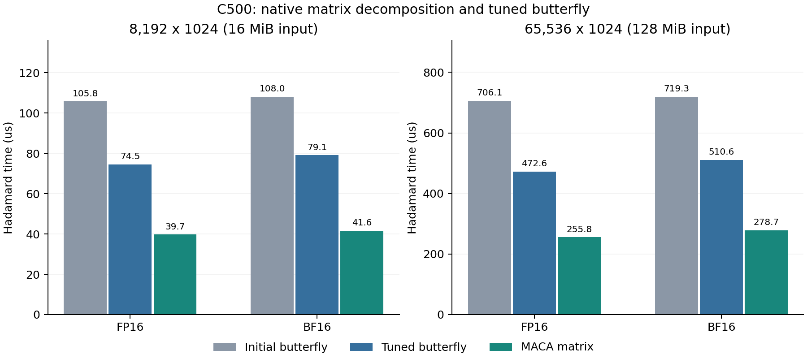

# MetaX C500 适配与性能报告

实测日期：2026-09-20（北京时间）。本报告使用同一台 C500 的优化前后数据；NVIDIA 历史结果单独保留。

## 环境与复现

单卡 MetaX C500，标称 64GB，104 个计算单元，原生 wave 为 64 线程。
实际环境为 Ubuntu 24.04.1、MACA SDK 3.3.0.15、驱动 3.8.30、Python 3.10.10、NumPy 1.26.4。CPU 配额为 12 核，内存 120GiB。以实测环境为准。
环境原始记录：[environment.txt](results/c500/environment.txt)、[device.json](results/c500/device.json)。

```bash
export MACA_PATH=/opt/maca
export LD_LIBRARY_PATH="$MACA_PATH/lib:${LD_LIBRARY_PATH:-}"
# 本次镜像的 NumPy 位于 /opt/conda；已配置 Python 的环境不需要此行。
export PATH="/opt/conda/bin:$PATH"
make PLATFORM=metax
mkdir -p results/c500
python3 tests/validate.py --binary build/metax/hadamard --output results/c500/correctness.json
python3 tests/benchmark.py --binary build/metax/hadamard --output-dir results/c500 --trials 3 --repeats 100 --materialized-compare
python3 tests/profile_metax.py
```

`PLATFORM=nvidia` 仍是默认值；C500 二进制单独放在 `build/metax/`。MACA 使用 cu-bridge 编译及运行时映射，不传 NVIDIA 架构参数。`make native` 是 NVIDIA 原生 FP8 对照，不用于 C500。

## 实现

- BF16 使用确定性 RNE 位转换，屏蔽 NVIDIA 专用 PTX；MXFP8/NVFP4 保持软件编码和原有文件协议。
- 量化保留 16/32 元素逻辑分组；C500 大张量每线程处理 8 个值，小于等于 65536 元素时使用标量 tile。FP32 全局最大值归约采用每线程 4 元素。
- 蝶形在 D≤128 时使用 32 线程逻辑分组，更大 D 使用原生 64 线程 wave；矩阵路径用 MACA 原生 FP16/BF16 m16n16k16 计算 H16，其余阶段在 FP32 寄存器和 wave shuffle 中完成，保持 O(D log D)。
- MACA fragment 布局来自实测 SDK 的 `__clang_maca_mma_functions.h`。A 的每线程位置为 `(lane%16, 4*(lane/16)+j)`，B/C 为 `(4*(lane/16)+j, lane%16)`；该实现单独放在 `src/metax_matrix.cuh`。
- 保留 FP16 稠密 WMMA 对照；FP16/BF16 分解矩阵路径分别测试非融合、全融合，以及 NVFP4 的变换+amax写回后向量量化方案。所有方案都保留中间 dtype 舍入；矩阵输入 fragment 每线程用一次 8 字节向量读取替代四次 16 位读取。
- 日志沿用 `factorized_tc_*` 字段名，在 C500 上表示 MACA 矩阵单元；默认输出仍为蝶形路径。矩阵路径可用 `--factorized_tc_output`、`--factorized_tc_packed` 保存；NVFP4 两步方案通过 `--materialized_compare 1 --factorized_tc_materialized_packed <文件>` 保存。

## 正确性

独立 NumPy 参考验证 **92 个用例全部通过**。结果：[correctness.json](results/c500/correctness.json)。
其中分解矩阵路径覆盖 76 个用例；蝶形 FP16/BF16 最大绝对误差分别为 0.0078125 / 0.015625，矩阵路径分别为 0.0078125 / 0.015625。全部低于 0.01 / 0.05。融合与各自非融合结果逐字节一致，NVFP4 两步方案同样逐字节一致。另验证非法维度拒绝。
本机 RTX 3060（ARCH=86）回归：92 个用例通过。记录：[NVIDIA regression](results/c500/correctness_nvidia_regression.json)。

## 性能

采用设备事件计时，先预热；每组 3 次独立试验，交替执行优化前后程序，取中位数。小规模每次重复 100 次，大规模重复 30 次。计时包含该流程的全部 GPU 步骤，排除文件 I/O、CPU 参考和主机传输。每次校验输出文件 SHA-256 一致。
对照基线：C500 initial matrix port: scalar fragment loads, 32-lane butterfly, original quantization geometry。二进制校验和、逐次时间和输出哈希见 [comparison.json](results/c500/comparison.json)。



### 独立变换

| 形状 | dtype | 蝶形前 μs | 蝶形后 μs | 分解矩阵 μs | 矩阵 / 原蝶形加速比 |
|---|---|---:|---:|---:|---:|
| 8192×64 | fp16 | 8.54 | 8.15 | 5.06 | 1.69× |
| 8192×128 | fp16 | 12.29 | 12.19 | 7.16 | 1.72× |
| 8192×1024 | fp16 | 105.76 | 74.47 | 39.69 | 2.66× |
| 8192×64 | bf16 | 8.46 | 8.54 | 4.91 | 1.72× |
| 8192×128 | bf16 | 12.83 | 12.71 | 7.39 | 1.74× |
| 8192×1024 | bf16 | 108.05 | 79.09 | 41.65 | 2.59× |
| 65536×1024 | fp16 | 706.06 | 472.57 | 255.75 | 2.76× |
| 65536×1024 | bf16 | 719.29 | 510.59 | 278.66 | 2.58× |

### 分解矩阵与量化

| 形状 | dtype | 格式 | 非融合 μs | 全融合 μs | 变换+amax后量化 μs |
|---|---|---|---:|---:|---:|
| 8192×128 | fp16 | mxfp8 | 24.50 | 18.07 | — |
| 8192×128 | fp16 | nvfp4 | 58.80 | 54.76 | 47.56 |
| 8192×1024 | fp16 | mxfp8 | 84.28 | 116.28 | — |
| 8192×1024 | fp16 | nvfp4 | 153.73 | 265.19 | 136.07 |
| 8192×128 | bf16 | mxfp8 | 24.52 | 18.26 | — |
| 8192×128 | bf16 | nvfp4 | 47.13 | 54.51 | 40.97 |
| 8192×1024 | bf16 | mxfp8 | 82.19 | 118.46 | — |
| 8192×1024 | bf16 | nvfp4 | 145.47 | 268.44 | 133.20 |
| 65536×1024 | fp16 | mxfp8 | 520.80 | 829.98 | — |
| 65536×1024 | fp16 | nvfp4 | 871.69 | 1858.21 | 832.16 |
| 65536×1024 | bf16 | mxfp8 | 544.26 | 848.75 | — |
| 65536×1024 | bf16 | nvfp4 | 893.40 | 1892.48 | 858.35 |

NVFP4 全融合需要先求全局 amax，再重新计算变换；写回中间结果的方案可以避免第二次变换。MXFP8 和 NVFP4 的最优方案应按表中实际测量选择，不能预设全融合总是最快。
归一化、随机符号旋转与三种分布的重建误差对照见 [rotation_quality.json](results/c500/rotation_quality.json)。

## 性能分析工具

已使用 MACA 自带 mcTracer 采集设备 kernel、运行时 API 和启动信息。原始 trace 与汇总位于 [profile/summary.json](results/c500/profile/summary.json)。分析器会扰动耗时，性能结论使用上面的未插桩事件计时；trace 只用于观察内核组成、启动配置和执行时间分布。

| trace 用例 | kernel | 次数 | 平均 μs（插桩） |
|---|---|---:|---:|
| mxfp8_fp16 | `hadamard_kernel<128, 0, 0>` | 69 | 21.393 |
| mxfp8_fp16 | `quant_vector_kernel<0, 1, 8>` | 46 | 19.612 |
| mxfp8_fp16 | `hadamard_kernel<128, 2, 0>` | 23 | 25.923 |
| mxfp8_fp16 | `hadamard_tc` | 23 | 51.501 |
| mxfp8_fp16 | `hadamard_mma_kernel<128, 1, 0, 0, 4>` | 46 | 7.007 |
| mxfp8_fp16 | `hadamard_mma_kernel<128, 1, 2, 0, 4>` | 23 | 17.853 |
| nvfp4_fp16 | `hadamard_kernel<128, 0, 0>` | 69 | 22.001 |
| nvfp4_fp16 | `maximum_vector<1, 8>` | 46 | 16.907 |
| nvfp4_fp16 | `quant_vector_kernel<1, 1, 8>` | 69 | 22.769 |
| nvfp4_fp16 | `hadamard_kernel<128, 1, 0>` | 23 | 14.214 |
| nvfp4_fp16 | `hadamard_kernel<128, 2, 1>` | 23 | 36.341 |
| nvfp4_fp16 | `hadamard_tc` | 23 | 51.512 |
| nvfp4_fp16 | `hadamard_mma_kernel<128, 1, 0, 0, 4>` | 46 | 7.274 |
| nvfp4_fp16 | `hadamard_mma_kernel<128, 1, 1, 1, 4>` | 23 | 9.617 |
| nvfp4_fp16 | `hadamard_mma_kernel<128, 1, 2, 1, 4>` | 23 | 30.575 |
| nvfp4_fp16 | `hadamard_mma_kernel<128, 1, 3, 1, 4>` | 23 | 11.420 |
| mxfp8_bf16 | `hadamard_kernel<128, 0, 0>` | 69 | 22.758 |
| mxfp8_bf16 | `quant_vector_kernel<0, 2, 8>` | 46 | 19.779 |
| mxfp8_bf16 | `hadamard_kernel<128, 2, 0>` | 23 | 25.578 |
| mxfp8_bf16 | `hadamard_mma_kernel<128, 2, 0, 0, 4>` | 46 | 7.329 |
| mxfp8_bf16 | `hadamard_mma_kernel<128, 2, 2, 0, 4>` | 23 | 18.076 |
| nvfp4_bf16 | `hadamard_kernel<128, 0, 0>` | 69 | 21.352 |
| nvfp4_bf16 | `maximum_vector<2, 8>` | 46 | 15.972 |
| nvfp4_bf16 | `quant_vector_kernel<1, 2, 8>` | 69 | 21.456 |
| nvfp4_bf16 | `hadamard_kernel<128, 1, 0>` | 23 | 14.748 |
| nvfp4_bf16 | `hadamard_kernel<128, 2, 1>` | 23 | 36.608 |
| nvfp4_bf16 | `hadamard_mma_kernel<128, 2, 0, 0, 4>` | 46 | 7.341 |
| nvfp4_bf16 | `hadamard_mma_kernel<128, 2, 1, 1, 4>` | 23 | 10.262 |
| nvfp4_bf16 | `hadamard_mma_kernel<128, 2, 2, 1, 4>` | 23 | 30.987 |
| nvfp4_bf16 | `hadamard_mma_kernel<128, 2, 3, 1, 4>` | 23 | 11.386 |

C500 的设备端内存检查本次未运行（镜像未提供可用工具）。NVIDIA 平台既有 Sanitizer 记录保留在 PROFILING.md 所列目录。
