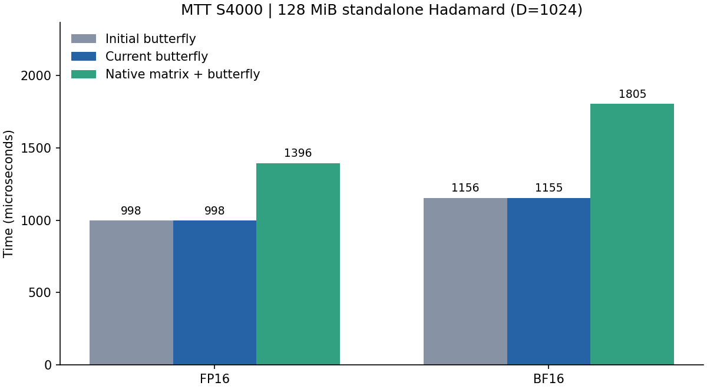

# Moore Threads MTT S4000 适配与性能报告

实测日期：2026-09-20。训练营 ID：曹泽阳；提交目录：`zmuxuny`。

## 环境与复现

单卡 MTT S4000，48GB 显存、64 个计算单元；MUSA SDK / mcc 4.3.6，目标 `mp_22`。`mthreads-gmi` 的驱动字符串为 `3.3.5-server`，运行时查询为 4.3。使用 `MUSA_VISIBLE_DEVICES=0` 固定单卡。设备属性报告物理 wave 为 128 线程；编译器 shuffle 接口使用 32 线程逻辑组，矩阵指令覆盖 128 线程。[环境记录](results/musa/environment.txt)、[SDK 版本](results/musa/sdk_version.json)。

```bash
export MUSA_PATH=/usr/local/musa
export MUSA_VISIBLE_DEVICES=0
export LD_LIBRARY_PATH="$MUSA_PATH/lib:${LD_LIBRARY_PATH:-}"
make PLATFORM=musa
make PLATFORM=musa numeric-test
python3 tests/validate.py --binary build/musa/hadamard --output results/musa/correctness.json
python3 tests/profile_musa.py
python3 tests/report_musa.py
```

源文件直接由 mcc 编译；`include/platform.cuh` 显式映射运行时 API，NVIDIA PTX 与 MUSA 矩阵实现分别编译。默认仍为 NVIDIA 构建，MUSA 二进制独立存放。

## 数值实现

- 软件 E4M3 / E2M1 编码、缩放、随机舍入与文件格式保持一致。编译开启精确除法并关闭浮点收缩。
- S4000 普通 FP32 乘法会将极小乘积冲为零。`multiply_rn` 对罕见下溢情况使用精确的 24×24 位整数乘积，并执行一次最近偶数舍入；正规乘积继续使用硬件。E8M0 最小/最大缩放也走保留极小值的路径。
- NVFP4 的 `divide_rn` 先构造快速商，再用 FMA 残差检验商的舍入区间。区间边界为分母乘 2 的幂，所选范围内精确可表示；只有严格落在区间内部才接受结果。中点、极端指数和未通过检验的候选退回 SDK 精确除法。
- MUSA 4.3.6 对部分尾块中 shuffle 后缩放值的零值判断存在优化问题；仅将该 NVFP4 解码结果物化为设备局部 `volatile`，避免错误折叠。相关奇数列、全零块与尾块均有独立参考测试。

## 验证

独立 NumPy 参考：**92 组全部通过**；[原始结果](results/musa/correctness.json)。其中 76 组覆盖分解矩阵路径；另有 1 组非法尺寸检查。FP16/BF16 最大绝对误差为 0.0078125 / 0.015625，低于 0.01 / 0.05。融合、非融合和 NVFP4 两步方案逐字节一致。

设备与主机精确对照：**49,152 项随机哈希、65,536 项乘法、1,048,576 项除法全部通过**。测试包含符号、指数边界、正规数/次正规数和幂次值；[日志](results/musa/numeric.log)。同一份公共代码在本机 RTX 3060 / sm_86 完成全套回归：[结果](results/musa/correctness_nvidia_regression.json)。

## 性能测量

基线为本卡上正确性验证通过的初始移植：保留 SDK 精确除法、初始启动配置及软件数值兼容处理。当前版本采用带区间校验的除法及实测选择的启动配置。通过 `tests/benchmark_tuning.py` 同机交替执行，每项 3 次独立试验取中位数；预热 3 次，小尺寸重复 100 次，大尺寸重复 30 次。采用未插桩 MUSA event 计时，包含各完整 GPU 流程，排除文件读写、主机传输和 CPU 参考。每次检查 packed SHA256 一致。[全部逐次记录](results/musa/comparison.json)。

基线和当前二进制 SHA256：

```text
before: 0d2069b0d0397437cb93e92a9144618d71c9484921fb3549e6841110a280318c
after: da5c704de5c6a5f94cd55e55cc31dee2e6d31c77f44666ce23314ffda422ae00
```

可在本目录副本中执行 `patch -p1 < results/musa/initial_port.patch` 还原基线，再 `make -B PLATFORM=musa`。补丁仅用于独立副本。



### 矩阵与蝶形设计

`src/musa_matrix.cuh` 以原生 FP16/BF16 WMMA 计算 H16，再进行 FP32 寄存器/逻辑组蝶形，复杂度为 O(D log D)。128 线程共同加载和执行矩阵运算，结果由前 32 线程持有。累加器映射依据 SDK 4.3.6 `crt/mma.hpp` 的存储实现：`x[j] → (lane/8 + 4*(j/2), lane%8 + 8*(j%2))`。共享内存复用前后执行全 CTA 同步，尾行补零；矩阵结束后才允许非结果线程退出。

稠密 FP16 WMMA 对照使用单个物理 wave 的 CTA，便于显式同步共享内存。分解矩阵、蝶形和稠密对照是不同算法路径；保留中间 FP16/BF16 舍入后再量化。

| 行数×维度 | dtype | 初始蝶形 μs | 当前蝶形 μs | 当前矩阵 μs | 矩阵 / 初始蝶形 |
|---|---|---:|---:|---:|---:|
| 32×64 | fp16 | 8.86 | 8.86 | 11.52 | 0.77× |
| 8192×64 | fp16 | 14.23 | 14.12 | 20.42 | 0.70× |
| 8192×128 | fp16 | 22.56 | 22.53 | 34.04 | 0.66× |
| 8192×256 | fp16 | 40.23 | 40.27 | 57.60 | 0.70× |
| 8192×512 | fp16 | 82.70 | 82.69 | 99.34 | 0.83× |
| 8192×1024 | fp16 | 192.37 | 192.66 | 215.36 | 0.89× |
| 32×64 | bf16 | 9.04 | 9.03 | 13.97 | 0.65× |
| 8192×64 | bf16 | 16.42 | 16.36 | 26.09 | 0.63× |
| 8192×128 | bf16 | 26.35 | 26.45 | 44.60 | 0.59× |
| 8192×256 | bf16 | 50.28 | 50.25 | 78.61 | 0.64× |
| 8192×512 | bf16 | 93.63 | 93.72 | 142.23 | 0.66× |
| 8192×1024 | bf16 | 217.14 | 217.63 | 276.15 | 0.79× |
| 65536×1024 | fp16 | 998.48 | 998.30 | 1396.01 | 0.72× |
| 65536×1024 | bf16 | 1155.80 | 1155.31 | 1805.00 | 0.64× |

### 融合方案

| 行数×维度 | dtype / 格式 | 矩阵非融合 μs | 矩阵全融合 μs | 写回后量化 μs（NVFP4） |
|---|---|---:|---:|---:|
| 8192×1024 | fp16 / mxfp8 | 366.84 | 910.41 | — |
| 8192×1024 | fp16 / nvfp4 | 737.20 | 3779.35 | 2219.30 |
| 8192×1024 | bf16 / mxfp8 | 429.11 | 936.58 | — |
| 8192×1024 | bf16 / nvfp4 | 816.76 | 4003.80 | 2531.47 |
| 65536×1024 | fp16 / mxfp8 | 2178.56 | 6657.04 | — |
| 65536×1024 | fp16 / nvfp4 | 4380.92 | 28435.55 | 16495.10 |
| 65536×1024 | bf16 / mxfp8 | 2601.12 | 6874.37 | — |
| 65536×1024 | bf16 / nvfp4 | 4871.33 | 30196.09 | 18582.14 |

矩阵速度与初始蝶形的比值是算法路径对照，同一矩阵 kernel 的前后时间保留在 JSON 中。全融合需要重算变换来取得 NVFP4 全局 amax；两步方案将变换结果写回以避免重算。按实测尺寸选择路径，不能由 kernel 数量推断性能。

参数扫描：[蝶形](results/musa/tune_butterfly.csv)、[矩阵](results/musa/tune_mma.csv)。MUSA 扫描使用 32 线程逻辑组，矩阵使用 128 线程物理 wave；完整候选结果与状态见 [扫描记录](results/musa/tuning_status.json)。

## 分布实验与路径结论

标准 `tests/benchmark.py` 另以 3 次独立试验、每次 30 次重复采样，记录在 [benchmark.json](results/musa/benchmark.json)。Hadamard 覆盖 24 个尺寸/类型/格式组合；正态与离群点分布的旋转重建误差见 [rotation_quality.json](results/musa/rotation_quality.json)。S4000 的大尺寸独立变换以蝶形路径更快，量化流水线以先变换、再量化更快；矩阵与全融合路径作为正确实现和算法对照保留。

## MUPTI 与工具记录

- `mxfp8_fp16`：60 条 kernel 记录，0 条有效时间戳，状态 `UNAVAILABLE_TIMESTAMPS`。
- `nvfp4_fp16`：96 条 kernel 记录，0 条有效时间戳，状态 `UNAVAILABLE_TIMESTAMPS`。
- `mxfp8_bf16`：54 条 kernel 记录，0 条有效时间戳，状态 `UNAVAILABLE_TIMESTAMPS`。
- `nvfp4_bf16`：90 条 kernel 记录，0 条有效时间戳，状态 `UNAVAILABLE_TIMESTAMPS`。

本镜像 MUPTI 返回 kernel 活动记录，但起止时间为零；原始日志提示未能在时限内收到 mt-perf 硬件事件。这些记录用于保留采样尝试与启动信息，不计入性能加速比；未获得可用的硬件计数器。镜像未提供可用 MUSA 设备端 Sanitizer。[采样命令、状态和二进制哈希](results/musa/profile/summary.json)、[工具复现入口](PROFILING.md)。

## 复核材料

代码旁注明线程组、fragment 坐标、舍入语义与平台兼容处理；原始数据保存在 `results/musa/`，源码 SHA256 清单见 [source_sha256.json](results/musa/source_sha256.json)。旧平台归档结果对应各自原始环境；本轮公共代码回归在 S4000 与 RTX 3060 完成。
