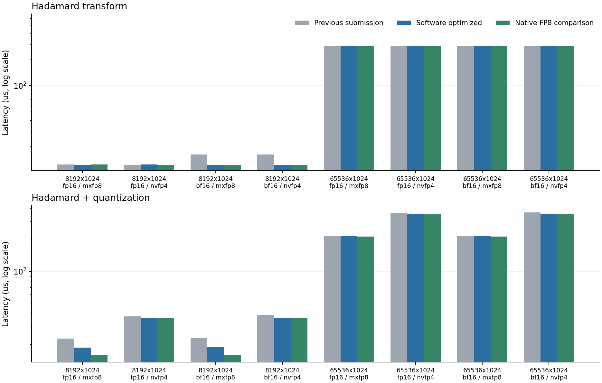

# RTX 4090 D 第二轮优化

实测日期：2026-09-19。本轮基线是第一轮已经提交的版本 `e7c2386`，不是最初版本。RTX 4090 D 24 GiB、CUDA 12.8、GCC 13、`sm_89`；编译保留 `--fmad=false`。默认程序继续使用软件 FP8/FP4 编码，可选 `_native` 程序使用 Ada 原生 E4M3 最近偶数转换。两者分别测试、分别计时。

## 测量与正确性

每组使用同一份 seed=42 正态输入，旧版、当前软件版、原生转换对照轮换执行顺序，各运行 3 个独立进程，报告中位数；每进程预热 3 次，小中张量重复 100 次，大张量重复 30 次。CUDA event 时间包括对应流程的全部 GPU 步骤，NVFP4 包括清零与全局最大值归约，不包括 CPU 参考、I/O、分配与传输。GPU 未锁频。大张量输入为 128 MiB，超过 72 MiB L2；小张量的结果可能受缓存影响。

[完整原始试验](results/4090d/tuning/comparison.json) 保留各次测量、可执行文件 SHA256，以及蝶形和分解 Tensor Core 的 packed 文件 SHA256；每个配置的所有程序、所有重复均检查对应路径的 packed 文件一致。

- 当前软件版：76 组正确性测试通过；详见 [correctness.json](results/4090d/tuning/correctness.json)。
- 原生 FP8 对照：76 组正确性测试通过；详见 [correctness_native.json](results/4090d/tuning/correctness_native.json)。
- RTX 3060 / CUDA 11.5 兼容版：76 组正确性测试通过；详见 [compatibility_3060.json](results/4090d/tuning/compatibility_3060.json)。
- 每个完整测试集包含 60 组分解 MMA 检查，覆盖 FP16/BF16、符号随机化、归一化、随机舍入与不满 CTA 的尾行；另检查 NVFP4 中间结果保留方案。BF16 转换额外比较 326,400 个有限 FP32 位模式，标量和双元素转换均逐位一致。


软件 E4M3 最近偶数舍入在正规数区间使用 `bits + 0x7ffff + retained_lsb` 后移位；尾数进位自然进入指数。次正规区间以精确二次幂缩放后做整数最近偶数转换，符号与负零单独保留。随机舍入仍按原概率与元素索引计算。该变更减少了量化和融合输出的标量指令，已由独立 NumPy 码本验证。


## 完整流程性能

表内均为分解 Tensor Core 路径，单位 μs。融合耗时包括 NVFP4 的完整 amax 预遍历；默认文件输出仍为蝶形路径，需用 `--factorized_tc_packed` 导出分解路径。

| 行数×维度 / dtype | 格式 | 单独变换：旧 / 新 | 融合：旧 / 软件 / 原生 FP8 | 软件融合加速 | 原生融合加速 |
| --- | --- | --- | --- | --- | --- |
| 8192×64 / fp16 | mxfp8 | 2.41 / 2.43 | 3.21 / 2.94 / 2.61 | 1.09× | 1.23× |
| 8192×64 / fp16 | nvfp4 | 2.46 / 2.46 | 6.91 / 6.83 / 6.78 | 1.01× | 1.02× |
| 8192×128 / fp16 | mxfp8 | 3.38 / 3.38 | 4.49 / 4.00 / 3.64 | 1.12× | 1.23× |
| 8192×128 / fp16 | nvfp4 | 3.35 / 3.34 | 9.15 / 9.04 / 8.95 | 1.01× | 1.02× |
| 8192×256 / fp16 | mxfp8 | 4.50 / 4.51 | 7.18 / 6.22 / 5.23 | 1.15× | 1.37× |
| 8192×256 / fp16 | nvfp4 | 4.51 / 4.51 | 13.49 / 13.14 / 12.99 | 1.03× | 1.04× |
| 8192×512 / fp16 | mxfp8 | 7.26 / 7.68 | 11.39 / 10.33 / 8.33 | 1.10× | 1.37× |
| 8192×512 / fp16 | nvfp4 | 7.24 / 7.71 | 20.18 / 21.14 / 19.45 | 0.95× | 1.04× |
| 8192×1024 / fp16 | mxfp8 | 12.36 / 12.30 | 22.75 / 18.65 / 15.87 | 1.22× | 1.43× |
| 8192×1024 / fp16 | nvfp4 | 12.31 / 12.33 | 37.19 / 36.11 / 35.62 | 1.03× | 1.04× |
| 8192×64 / bf16 | mxfp8 | 2.57 / 2.46 | 3.33 / 2.93 / 2.62 | 1.14× | 1.27× |
| 8192×64 / bf16 | nvfp4 | 2.50 / 2.47 | 7.06 / 6.87 / 6.78 | 1.03× | 1.04× |
| 8192×128 / bf16 | mxfp8 | 3.65 / 3.35 | 4.64 / 4.03 / 3.69 | 1.15× | 1.26× |
| 8192×128 / bf16 | nvfp4 | 3.60 / 3.37 | 9.30 / 9.07 / 9.02 | 1.02× | 1.03× |
| 8192×256 / bf16 | mxfp8 | 5.00 / 4.53 | 7.46 / 6.16 / 5.26 | 1.21× | 1.42× |
| 8192×256 / bf16 | nvfp4 | 5.06 / 4.55 | 13.74 / 13.17 / 13.05 | 1.04× | 1.05× |
| 8192×512 / bf16 | mxfp8 | 8.44 / 7.71 | 12.51 / 10.35 / 8.96 | 1.21× | 1.40× |
| 8192×512 / bf16 | nvfp4 | 8.43 / 7.71 | 22.17 / 21.10 / 20.79 | 1.05× | 1.07× |
| 8192×1024 / bf16 | mxfp8 | 16.15 / 12.27 | 23.09 / 18.79 / 15.84 | 1.23× | 1.46× |
| 8192×1024 / bf16 | nvfp4 | 16.17 / 12.30 | 38.38 / 36.20 / 35.70 | 1.06× | 1.08× |
| 65536×1024 / fp16 | mxfp8 | 285.83 / 285.93 | 217.43 / 215.93 / 214.97 | 1.01× | 1.01× |
| 65536×1024 / fp16 | nvfp4 | 285.97 / 286.01 | 360.89 / 354.07 / 351.23 | 1.02× | 1.03× |
| 65536×1024 / bf16 | mxfp8 | 286.14 / 286.96 | 217.70 / 215.93 / 215.11 | 1.01× | 1.01× |
| 65536×1024 / bf16 | nvfp4 | 285.76 / 286.52 | 364.54 / 354.07 / 351.13 | 1.03× | 1.04× |

## 设计与消融

BF16 在 Ampere 及更新架构使用原生 RN 转换，输出相邻元素用 `cvt.rn.bf16x2.f32` 打包；CPU 与 sm_75 保留整数位运算实现。MMA 仍采用 H16 小块乘法和 FP32 蝶形分解。普通量化、非融合对照同步使用题目 2 的向量化量化和 amax 归约，因此融合加速比的分母也随之变快。融合并非每种形状都优于非融合，原始 JSON 同时提供 `factorized_tc_unfused_ms` 与 `factorized_tc_fused_ms`。

[线程块扫描](results/4090d/tuning/tune_mma.csv) 比较 1/2/4/8/16 个 warp。多数尺寸原来的 4 warp 已较好，大尺寸增加 warp 并没有稳定的统一收益，因此默认保持 4 warp。该扫描在软件编码下完成，比较变换输出和 packed 字节，不将噪声级差异用于复杂形状调度。

`--materialized_compare 1` 是 NVFP4 的对照路径：第一次变换同时保存中间张量和 amax，再向量量化，避免第二次 Hadamard，但增加中间写回/读取。每次执行都与同一 MMA 的非融合结果比较 packed 字节；原始 JSON 的 `factorized_tc_materialized_ms` 保存测量。该方案在本次扫描中没有稳定的整体优势，保持为显式对照选项。


## 可选原生 FP8 对照

默认 `make` 仍构建软件 E4M3/E2M1 编码。额外执行 `make native ARCH=89` 可生成独立的 `_native` 程序，要求 CUDA >=12.1 和 sm_89 或更新；两路可以同时存在。原生对照使用 `cvt.rn.satfinite.e4m3x2.f32` 一次转换两个相邻值，低/高字节顺序与 packed 格式一致。随机舍入沿用软件编码，NVFP4 的 E2M1 数据仍由软件编码，只有 E4M3 scale 可用原生转换。日志 `fp8_encoding` 明确区分两路。

指令与架构依据：[NVIDIA PTX ISA](https://docs.nvidia.com/cuda/parallel-thread-execution/index.html#data-movement-and-conversion-instructions-cvt)。这个对照不替代题目 2 的软件实现，也不是 FP8/FP4 Tensor Core 矩阵乘法。

## Profiler 与 Sanitizer

- 软件版：memcheck、racecheck、synccheck 共 18 次全部通过；[原始日志与退出码](results/4090d/tuning/software/profiling.json)。
- 原生对照：memcheck、racecheck、synccheck 共 18 次全部通过；[原始日志与退出码](results/4090d/tuning/native/profiling.json)。

两种格式、两路实现均采集 Nsight Systems 时间线，见各 `software/`、`native/` 下的 `timeline_*.nsys-rep` 和 `nsys_stats_*.csv`。分析使用无插桩 event 时间；时间线用于确认 kernel 与启动次数。Nsight Compute 仍因宿主机 `ERR_NVGPUCTRPERM` 无法访问计数器，未把静态资源或逻辑带宽冒充硬件 occupancy、DRAM 或 stall 测量。



## 复现

```bash
make clean
make all native ARCH=89 NVCC=/usr/local/cuda/bin/nvcc HOSTCXX=g++
mkdir -p results/4090d/tuning
python3 tests/validate.py --output results/4090d/tuning/correctness.json
python3 tests/validate.py --binary build/hadamard_native --output results/4090d/tuning/correctness_native.json
python3 tests/benchmark_tuning.py --before /path/to/first-optimized/hadamard --after build/hadamard --native build/hadamard_native --output results/4090d/tuning/comparison.json
python3 tests/profile_native.py --output results/4090d/tuning/software
python3 tests/profile_native.py --binary build/hadamard_native --output results/4090d/tuning/native
python3 tests/report_tuning.py
```

微基准用 `nvcc -std=c++17 -O3 --fmad=false -lineinfo -arch=sm_89` 编译 `tests/tune_*.cu` 后直接运行即可输出 CSV；题目 3 另加 `-DLP_CUDA_ARCH=89`。BF16 位模式检查位于题目 3 的 `tests/check_bf16.cu`。测试和采样顺序执行，不与其他 GPU 负载并发。第一轮完整结果保留在 [REPORT_4090D.md](REPORT_4090D.md)，本轮环境与源代码/二进制指纹见 [environment.json](results/4090d/tuning/environment.json)。
